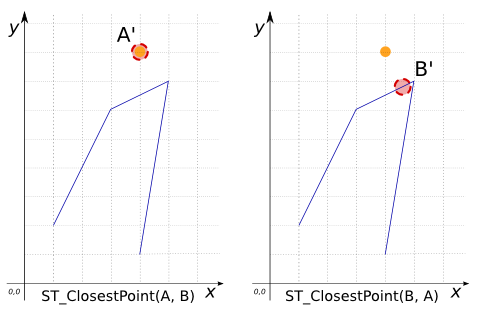
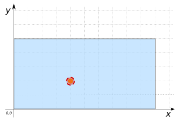
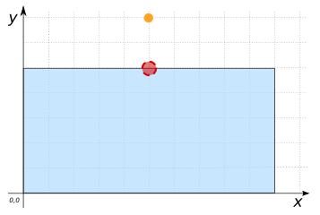

### Signature


Point ST_ClosestPoint(GEOMETRY geomA, GEOMETRY geomB);


### Description
`ST_ClosestPoint` returns the 2D point on `geomA` that is closest to `geomB`. If the closest POINT is not unique, it returns the first one it finds. This means that the POINT returned depends on the order of the Geometry's coordinates.

### Examples

| geomA Point | geomB Polygon |
| ----|---- |
| POINT(4 8) | LINESTRING(1 2, 3 6, 5 7, 4 1) |


SELECT  ST_ClosestPoint(geomA, geomB);
--  Answer: POINT(4 8)

SELECT  ST_ClosestPoint(geomB, geomA);
--  Answer: POINT (4.6 6.8)



SELECT  ST_ClosestPoint('POLYGON((0 0, 10 0, 10 5, 0 5, 0 0))',
    'POINT(4 2)');
--  Answer: POINT(4 2)



SELECT  ST_ClosestPoint('POLYGON((0 0, 10 0, 10 5, 0 5, 0 0))',
    'POINT(5 7)');
--  Answer: POINT(5 5)


##### See also

* <a href="https://github.com/irstv/H2GIS/blob/master/h2spatial-ext/src/main/java/org/h2gis/h2spatialext/function/spatial/distance/ST_ClosestPoint.java" target="_blank">Source code</a>
