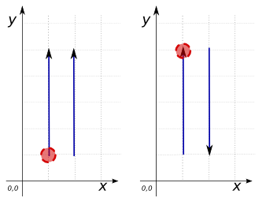
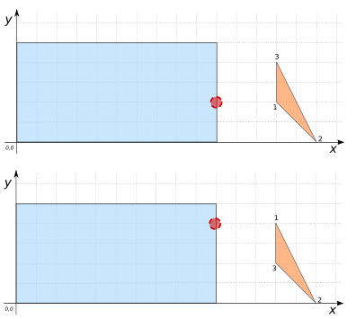

### Signature


Point ST_ClosestPoint(GEOMETRY geomA, GEOMETRY geomB);


### Description
`ST_ClosestPoint` returns the 2D point on `geomA` that is closest to `geomB`. If the closest `POINT` is not unique, it returns the first one it finds. This means that the `POINT` returned depends on the order of the Geometry's coordinates.

### Examples

| geomA Point | geomB Polygon |
| ----|---- |
| POINT(4 8) | LINESTRING(1 2, 3 6, 5 7, 4 1) |


SELECT  ST_ClosestPoint(geomA, geomB);
-- Answer: POINT(4 8)

SELECT  ST_ClosestPoint(geomB, geomA);
-- Answer: POINT(4.6 6.8)



SELECT  ST_ClosestPoint('POLYGON((0 0, 10 0, 10 5, 0 5, 0 0))',
    'POINT(4 2)');
-- Answer: POINT(4 2)



SELECT  ST_ClosestPoint('POLYGON((0 0, 10 0, 10 5, 0 5, 0 0))',
    'POINT(5 7)');
-- Answer: POINT(5 5)



SELECT ST_ClosestPoint('LINESTRING(1 1, 1 5))', 
    'LINESTRING(2 1, 2 5))'),
  ST_ClosestPoint('LINESTRING(1 1, 1 5))', 
    'LINESTRING(2 5, 2 1))');
-- Answer: POINT(1 1)
--  POINT(1 5)


This example shows that the `POINT` returned by `ST_ClosestPoint` depends on the orientations of Geometries A and B. If they have the same orientation, the `POINT` returned is the first `POINT` found in A. If they have opposite orientation, the `POINT` returned is the `POINT` of A closest to the first `POINT` found in B.


SELECT ST_ClosestPoint('POLYGON((0 0, 10 0, 10 5, 0 5, 0 0))',
    'POLYGON((13 2, 15 0, 13 4, 13 2))'),
  ST_ClosestPoint('POLYGON((0 0, 10 0, 10 5, 0 5, 0 0))',
    'POLYGON((13 4, 13 2, 15 0, 13 4))');
-- Answer: POINT(10 2)
--  POINT(10 4)


In this example, there are infinitely many closest points, but `ST_ClosestPoint` returns the first one it finds. The `POLYGON` listed as the second parameter remains the same, but its coordinates are listed in a different order.

##### See also

* <a href="https://github.com/irstv/H2GIS/blob/master/h2spatial-ext/src/main/java/org/h2gis/h2spatialext/function/spatial/distance/ST_ClosestPoint.java" target="_blank">Source code</a>
