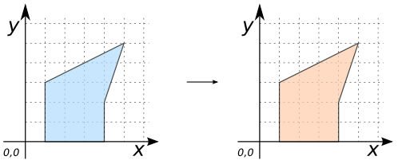
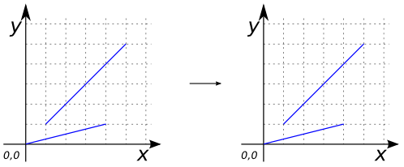
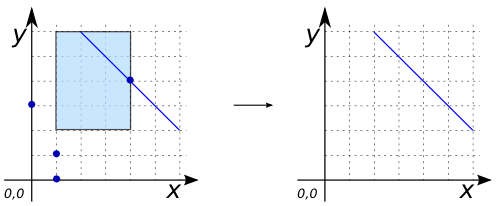
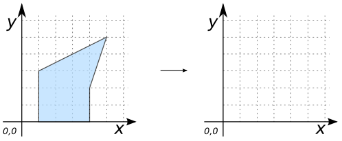

### Signatures


GEOMETRY ST_CollectionExtract(GEOMETRY geom, int dimension);


### Description

Given a `(multi)geometry`, returns a `(multi)geometry` consisting only of elements of the specified `dimension`. Dimension numbers are 1 for `POINT`, 2 for `LINESTRING` and 3 for `POLYGON`.

Sub-geometries that are not the specified type are ignored.

If there are no sub-geometries of the right type, an `EMPTY geometry` will be returned. 

Only `POINT`s, `LINE`s and `POLYGON`s are returned.

### Examples


SELECT ST_CollectionExtract('POLYGON ((1 3, 1 0, 4 0, 4 2, 5 5, 1 3))', 3) as GEOM;
-- Answer: POLYGON ((1 3, 1 0, 4 0, 4 2, 5 5, 1 3)) 



SELECT ST_CollectionExtract('MULTILINESTRING ((0 0, 4 1), (1 1, 5 5))', 2) as GEOM;
-- Answer: MULTILINESTRING ((0 0, 4 1), (1 1, 5 5))



SELECT ST_CollectionExtract('GEOMETRYCOLLECTION(
                       MULTIPOINT((4 4), (1 1), (1 0), (0 3)),
                       LINESTRING(2 6, 6 2),
                       POLYGON((1 2, 4 2, 4 6, 1 6, 1 2)))', 2) 
                       as GEOM;
-- Answer: LINESTRING (2 6, 6 2)  



SELECT ST_CollectionExtract('POLYGON ((1 3, 1 0, 4 0, 4 2, 5 5, 1 3))', 2) as GEOM;
-- Answer: GEOMETRYCOLLECTION EMPTY


##### See also

* [`ST_Dimension`](../ST_Dimension), [`ST_GeometryType`](../ST_GeometryType), [`ST_CoordDim`](../ST_CoordDim)
* <a href="https://github.com/orbisgis/h2gis/blob/master/h2gis-functions/src/main/java/org/h2gis/functions/spatial/edit/ST_CollectionExtract.java" target="_blank">Source code</a>
