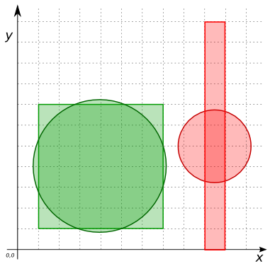

 
### Signature


double ST_CompactnessRatio(POLYGON poly);


### Description

`ST_CompactnessRatio` computes the perimeter of a circle whose area is equal to the given `POLYGON`'s area, and returns the ratio of this computed perimeter to the given `POLYGON`'s perimeter.

Equivalent definition: `ST_CompactnessRatio` returns the square root of the `POLYGON`'s area divided by the area of the circle with circumference equal to the `POLYGON`'s perimeter.

Note: This uses the 2D perimeter/area of the `POLYGON`.
This function accepts only `POLYGON`s.

### Examples


CREATE TABLE input_table(geom Geometry);
INSERT INTO input_table VALUES
    ('POLYGON ((9 0, 9 11, 10 11, 10 0, 9 0))'),
    ('POLYGON ((1 1, 1 7, 7 7, 7 1, 1 1))');
SELECT ST_CompactnessRatio(geom) ratio FROM input_table;
-- Answer:
--    |         RATIO       |
--    |---------------------|
--    | 0.48988036513951067 |
--    |  0.886226925452758  |


*Note*: In this example, both geometries have a perimeter equal to 24.


SELECT ST_CompactnessRatio(ST_Buffer(('POINT(1 2)'), 10));
-- Answer: 0.9983912919723259
--    Note : That a buffer is not a circle. It's an
--    approximation, ST_Buffer create 32 segments to arc of a
--    cercle. That's why the compactness ratio is not equal to 1.

SELECT ST_CompactnessRatio(ST_MakeEllipse('POINT(1 2)', 10, 10));
-- Answer: 0.9998354822360185
--    Note : ST_MaketEllipse create 100 segments to arc of a
--    cercle. That's why the compactness ratio is not equal to 1
--    but is more precise than ST_Buffer.

SELECT ST_CompactnessRatio(
    'POLYGON ((4 12, 1 6, 6 3, 15 2, 17 5, 16 10, 9 14, 4 12), 
    (7 9, 6 7, 10 6, 10 8, 7 9))');
-- Answer: 0.7142366622175312

SELECT ST_CompactnessRatio(
    'POLYGON((0 0 0, 3 0 0, 3 2 0, 0 2 1, 0 0 0))');
-- Answer: 0.8683215054699213

SELECT ST_CompactnessRatio('POINT(1 2)');
-- Answer: null 


##### See also

* <a href="http://www.h2gis.org/docs/dev/ST_Buffer" target="_blank">ST_Buffer</a>
* <a href="http://www.h2gis.org/docs/dev/ST_MakeEllipse" target="_blank">ST_MakeEllipse</a>
* <a href="https://github.com/irstv/H2GIS/blob/master/h2spatial-ext/src/main/java/org/h2gis/h2spatialext/function/spatial/properties/ST_CompactnessRatio.java" target="_blank">Source code</a>
