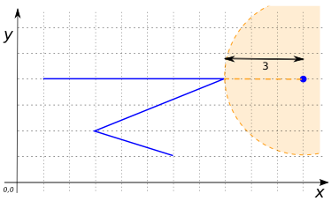
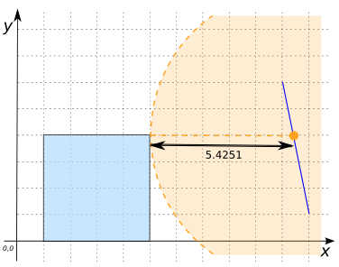
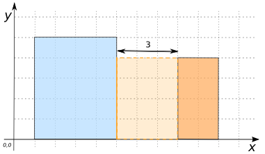

### Signature


double ST_Distance(GEOMETRY geomA,GEOMETRY geomB);


### Description

Returns the 2-dimensional minimum Cartesian distance between two Geometries in projected units (spatial ref units).



### Examples


SELECT ST_Distance('POINT(11 4)', 
    'LINESTRING(1 4, 8 4, 3 2, 6 1)');
-- Answer: 3.0



SELECT ST_Distance('LINESTRING(11 4, 9 1)', 
    'LINESTRING(1 4, 8 4, 3 2, 6 1)');
-- Answer: 2.496150883013531



SELECT ST_Distance('LINESTRING(10 7, 11 1)', 
    'POLYGON((1 0, 1 4, 5 4, 5 0, 1 0))');
-- Answer: 5.42516658107679



SELECT ST_Distance('POLYGON((8 0, 8 4, 10 4, 10 0, 8 0))', 
    'POLYGON((1 0, 1 4, 5 4, 5 0, 1 0))');
-- Answer: 3.0


##### See also

* <a href="https://github.com/irstv/H2GIS/blob/master/h2spatial/src/main/java/org/h2gis/h2spatial/internal/function/spatial/properties/ST_Distance.java" target="_blank">Source code</a>
