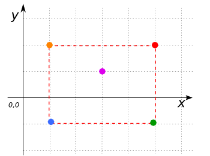
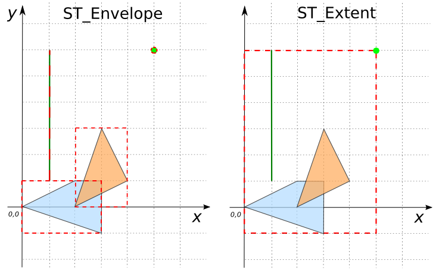

### Signatures


GEOMETRY ST_Envelope(GEOMETRY geom, int srid);
GEOMETRY ST_Envelope(GEOMETRYCOLLECTION geom, int srid);


### Description

Returns Geometry envelope as `GEOMETRY`



### Examples


SELECT ST_Envelope('POINT(1 2)', 2154);
-- Answer: POINT (1 2)

SELECT ST_Envelope('MULTIPOINT(1 2, 3 1, 2 2, 5 1, 1 -1)', 2154);
-- Answer: POLYGON((1 -1, 1 2, 5 2, 5 -1, 1 -1))



SELECT ST_Envelope('LINESTRING(1 1, 2 1)', 2154);
-- Answer: LINESTRING (1 1, 2 1)

SELECT ST_Envelope('LINESTRING(1 2, 5 3, 2 6)', 2154);
-- Answer: POLYGON((1 2, 1 6, 5 6, 5 2, 1 2))



SELECT ST_Envelope('POLYGON ((0 -1, 0 2, 3 2, 3 -1, 0 -1))', 
    2154);
-- Answer: POLYGON ((0 -1, 0 2, 3 2, 3 -1, 0 -1))

CREATE TABLE input_table(geom GEOMETRY);
INSERT INTO input_table VALUES 
     ('POLYGON ((0 0, 3 -1, 1.5 2, 0 0))'), 
     ('POLYGON ((2 0, 3 3, 4 2, 2 0))'), 
     ('POINT(5 6)'), 
     ('LINESTRING(1 1, 1 6)');

SELECT ST_Envelope(geom, 2154) FROM input_table;
-- Answer: POLYGON ((0 -1, 0 2, 3 2, 3 -1, 0 -1))
--         POLYGON ((2 0, 2 3, 4 3, 4 0, 2 0))
--         POINT (5 6)
--         LINESTRING (1 1, 1 6)

CREATE TABLE input_table(geom GEOMETRY);
INSERT INTO input_table VALUES 
     ('POLYGON ((0 0, 3 -1, 1.5 2, 0 0))'), 
     ('POLYGON ((2 0, 3 3, 4 2, 2 0))'), 
     ('POINT(5 6)'), 
     ('LINESTRING(1 1, 1 6)');
SELECT ST_Extent(geom) FROM input_table;
-- Answer: POLYGON ((0 -1, 0 6, 5 6, 5 -1, 0 -1))


Note: This example shows ST_Extent is a aggregate function and ST_Envelope is scalar function. ST_Envelope returns a minimum bounding box to each Geometry. Whereas ST_Extent returns a minimum bounding box of set Geometry.

##### See also

* [`ST_Extent`](../ST_Extent)
* <a href="https://github.com/irstv/H2GIS/blob/master/h2spatial/src/main/java/org/h2gis/h2spatial/internal/function/spatial/properties/ST_Envelope.java" target="_blank">Source code</a>
