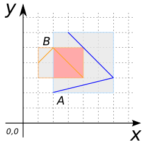
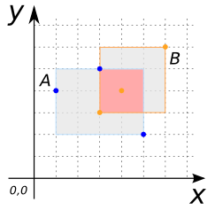

### Signatures


boolean ST_EnvelopesIntersect(GEOMETRY geomA, GEOMETRY geomB);


### Description

Returns true if the envelope of `geomA` intersects the envelope of `geomA`.

As a consequence, if `ST_Intersects(geomA, geomB)` is true, then
`ST_EnvelopesIntersect(geomA, geomB)` is true.

<!-- This function does not seem to be SFS. Is it SQL-MM? -->

### Examples

##### Cases where `ST_EnvelopesIntersect` is true
 

SELECT ST_EnvelopesIntersect(geomA, geomB) FROM input_table;
-- Answer:    True


| geomA POLYGON | geomB POLYGON |
| ----|---- |
| POLYGON ((3 1, 3 4, 5 7, 1 5, 3 1)) | POLYGON ((7 2, 7 6, 4 4, 7 2)) |

| geomA LINESTRING | geomB LINESTRING |
| ----|---- |
| LINESTRING (2 2, 6 3, 3 6) | LINESTRING (1 4, 2 5, 4 3) |

| geomA MULTIPOINT | geomB MULTIPOINT |
| ----|---- |
| MULTIPOINT ((1 4), (3 5), (5 2)) | MULTIPOINT ((3 3), (4 4), (6 6)) |

| geomA POLYGON | geomB GEOMETRYCOLLECTION |
| ----|---- |
| POLYGON ((4 2, 5 2, 5 4, 4 5, 3 4, 4 3, 4 2)) | GEOMETRYCOLLECTION (POINT (2 3), LINESTRING (6 4, 4 6), POLYGON ((2 5, 3 5, 3 6, 2 6, 2 5))) |

##### Cases where `ST_EnvelopesIntersect` is false
 

SELECT ST_EnvelopesIntersect(geomA, geomB) FROM input_table;
-- Answer:    False


| geomA POLYGON | geomB POLYGON |
| ----|---- |
| POLYGON ((3 1, 3 4, 5 7, 1 5, 3 1)) | POLYGON ((8 2, 8 6, 6 5, 8 2)) |

##### See also

* [`ST_Intersects`](../ST_Intersects), [`ST_Envelope`](../ST_Envelope)
* <a href="https://github.com/irstv/H2GIS/blob/master/h2spatial/src/main/java/org/h2gis/h2spatial/internal/function/spatial/predicates/ST_EnvelopesIntersect.java" target="_blank">Source code</a>
