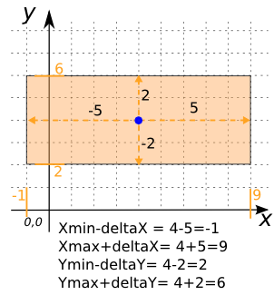
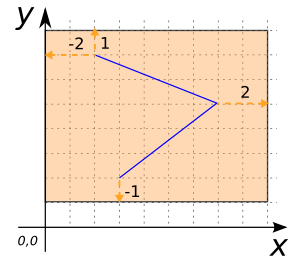
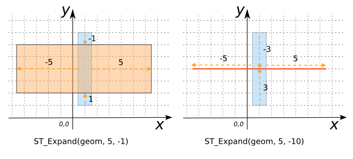

### Signature


GEOMETRY ST_Expand(GEOMETRY geom, double deltaX, double deltaY);


### Description
Returns a `GEOMETRY`'s envelope by the given `delta X` and `delta Y`. Both positive and negative distances are supported.

### Examples


SELECT ST_Expand('POINT(4 4)', 5, 2);
-- Answer: POLYGON ((-1 2, -1 6, 9 6, 9 2, -1 2))



SELECT ST_Expand('LINESTRING(3 2, 7 5, 2 7)', 2, 1);
-- Answer: POLYGON ((0 1, 0 8, 9 8, 9 1, 0 1))



SELECT ST_Expand('POLYGON ((0.5 1, 0.5 7, 1.5 7, 1.5 1, 0.5 1))', 5, -10);
-- Answer: LINESTRING (-4.5 4, 6.5 4)

SELECT ST_Expand('POLYGON ((0.5 1, 0.5 7, 1.5 7, 1.5 1, 0.5 1))', 5, -1);
-- ANswer: POLYGON ((-4.5 2, -4.5 6, 6.5 6, 6.5 2, -4.5 2))


##### See also

* <a href="https://github.com/irstv/H2GIS/blob/master/h2spatial-ext/src/main/java/org/h2gis/h2spatialext/function/spatial/create/ST_Expand.java" target="_blank">Source code</a>
* Added: <a href="https://github.com/irstv/H2GIS/pull/80" target="_blank">#80</a>
