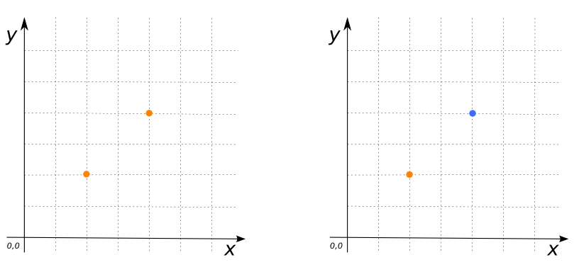

 
### Signature


tableName [*, explod_id] ST_Explode('tableName')

tableName[*, explod_id] ST_Explode('tableName', 'fieldName')


### Description
This table function explode `Geometry Collection` in the `fieldName` column of table
`tableName` into multiple Geometries. 
If no field name is specified, the first Geometry column is used. 

### Examples


CREATE TABLE test_point AS SELECT
    'MULTIPOINT((1 1), (2 2))'::Geometry the_geom;
SELECT * FROM st_explode('test_point');
-- Answer:
--    |   THE_GEOM  | EXPLOD_ID |
--    | ------------|-----------|
--    | POINT (1 1) |     1     |
--    | POINT (2 2) |     2     |



CREATE TABLE test_point AS SELECT
    'MULTIPOINT((1 1), (2 2))'::Geometry the_geomA,
    'MULTIPOINT((3 3), (2 6))'::Geometry the_geomB;
SELECT * FROM ST_Explode('test_point', 'the_geomB');
-- Answer:
--    |   THE_GEOMB | EXPLOD_ID |
--    | ------------|-----------|
--    | POINT (3 3) |     1     |
--    | POINT (2 6) |     2     |


##### See also

* <a href="https://github.com/irstv/H2GIS/blob/master/h2spatial-ext/src/main/java/org/h2gis/h2spatialext/function/spatial/properties/ST_Explode.java" target="_blank">Source code</a>
