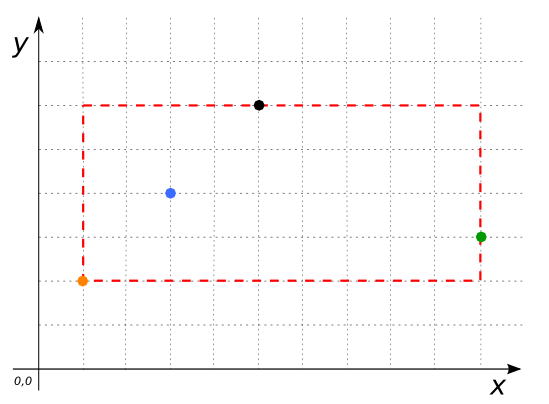

 
### Signature


GEOMETRY ST_Extent(GEOMETRY geom);
GEOMETRY ST_Extent(GEOMETRYCOLLECTION geom);


### Description

Returns the minimum bounding box that encloses `geom` as a `GEOMETRY`.

### Examples


SELECT ST_Extent('MULTIPOINT((5 6), (1 2), (3 4), (10 3))'::Geometry);
-- Answer: POLYGON ((1 2, 1 6, 10 6, 10 2, 1 2))



CREATE TABLE input_table(geom GEOMETRY);
INSERT INTO input_table VALUES 
     ('POLYGON ((0 0, 3 -1, 1.5 2, 0 0))'), 
     ('POLYGON ((2 0, 3 3, 4 2, 2 0))'), 
     ('POINT(5 6)'), 
     ('LINESTRING(1 1, 1 6)');
SELECT ST_EXTENT(geom) FROM input_table;
-- Answer: POLYGON ((0 -1, 0 6, 5 6, 5 -1, 0 -1))



SELECT ST_Extent('POINT(5 6)'::Geometry);
-- Answer: POINT(5 6)


##### See also
* [`ST_Envelope`](../ST_Envelope)
* <a href="https://github.com/irstv/H2GIS/blob/master/h2spatial-ext/src/main/java/org/h2gis/h2spatialext/function/spatial/properties/ST_Extent.java" target="_blank">Source code</a>
