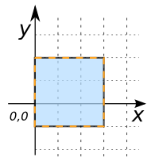

### Signature


LinearRing ST_ExteriorRing(GEOMETRY geom);


### Description

Returns a `LinearRing` instance or Null if parameter is not a `POLYGON`.



### Examples


SELECT ST_ExteriorRing('POLYGON((0 -1, 0 2, 3 2, 3 -1, 0 -1))');
-- Answer: LINEARRING(0 -1, 0 2, 3 2, 3 -1, 0 -1)


##### Comparison with [`ST_Boundary`](../ST_Boundary)



##### See also

* [`ST_Boundary`](../ST_Boundary), [`ST_InteriorRingN`](../ST_InteriorRingN)
* <a href="https://github.com/irstv/H2GIS/blob/master/h2spatial/src/main/java/org/h2gis/h2spatial/internal/function/spatial/properties/ST_ExteriorRing.java" target="_blank">Source code</a>
