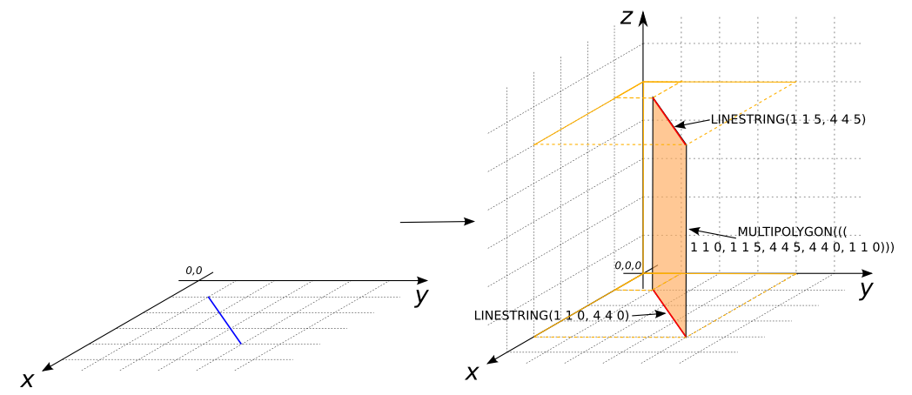
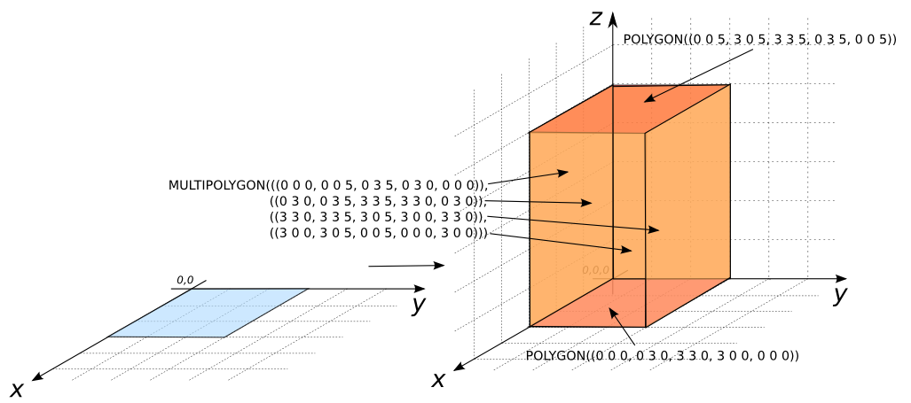

### Signatures


GEOMETRYCOLLECTION ST_Extrude(GEOMETRY geom, double height);
GEOMETRYCOLLECTION ST_Extrude(GEOMETRY geom, double height, int
flag);


### Description
Returns a 3D representation in a `GEOMETRYCOLLECTION` containing 
floor (input `GEOMETRY`), wall and roof Geometries from to 
`LINESTRING` or `POLYGON`.

The value for `flag` is 1 to extracts walls and 2 to extracts the roof.

### Examples


SELECT ST_Extrude('LINESTRING(1 1, 4 4)', 5);
-- Answer: GEOMETRYCOLLECTION(
--    (floor)      LINESTRING(1 1, 4 4), 
--    (wall)       MULTIPOLYGON(((1 1, 1 1, 4 4, 4 4, 1 1))), 
--    (roof)       LINESTRING(1 1, 4 4))
SELECT ST_ZMin(ST_Extrude('LINESTRING(1 1, 4 4)', 5)), 
       ST_ZMax(ST_Extrude('LINESTRING(1 1, 4 4)', 5));
-- Answer: 0.0 ; 5.0


*Note*: Currently the WKT cannot display the Z value of the Geometry, 
but the WKB stores and manages the Z value. If you want to see the Z 
value you can use ST_ZMin, ST_ZMax functions. 

In the next examples, the result is write with the Z value.


SELECT ST_Extrude('LINESTRING(1 1, 4 4)', 5);
-- Answer: GEOMETRYCOLLECTION(
--             LINESTRING(1 1 0, 4 4 0), 
--             MULTIPOLYGON(((1 1 0, 1 1 5, 4 4 5, 4 4 0, 1 1 0))), 
--             LINESTRING(1 1 5, 4 4 5))



SELECT ST_Extrude('POLYGON((0 0, 3 0, 3 3, 0 3, 0 0))', 5);
-- Answer: GEOMETRYCOLLECTION(
--             POLYGON((0 0 0, 0 3 0, 3 3 0, 3 0 0, 0 0 0)), 
--             MULTIPOLYGON(((0 0 0, 0 0 5, 0 3 5, 0 3 0, 0 0 0)), 
--                          ((0 3 0, 0 3 5, 3 3 5, 3 3 0, 0 3 0)), 
--                          ((3 3 0, 3 3 5, 3 0 5, 3 0 0, 3 3 0)), 
--                          ((3 0 0, 3 0 5, 0 0 5, 0 0 0, 3 0 0))),  
--             POLYGON((0 0 5, 3 0 5, 3 3 5, 0 3 5, 0 0 5))) 


###### POLYGON with hole:


SELECT ST_Extrude('POLYGON((0 10, 10 10, 10 0, 0 0, 0 10), 
                      (1 3, 3 3, 3 1, 1 1, 1 3))', 10);
-- Answer: GEOMETRYCOLLECTION(
--             POLYGON((0 10 0, 10 10 0, 10 0 0, 0 0 0, 0 10 0), 
--                (1 3 0, 3 3 0, 3 1 0, 1 1 0, 1 3 0)), 
--             MULTIPOLYGON(((0 10, 0 10, 10 10, 10 10, 0 10)), 
--                ((10 10, 10 10, 10 0, 10 0, 10 10)), 
--                ((10 0, 10 0, 0 0, 0 0, 10 0)), 
--                ((0 0, 0 0, 0 10, 0 10, 0 0)), 
--                ((1 3, 1 3, 1 1, 1 1, 1 3)), 
--                ((1 1, 1 1, 3 1, 3 1, 1 1)), 
--                ((3 1, 3 1, 3 3, 3 3, 3 1)), 
--                ((3 3, 3 3, 1 3, 1 3, 3 3)))
--             POLYGON((0 10 10, 0 0 10, 10 0 10, 10 10 10, 0 10 10),
--                (1 3 10, 3 3 10, 3 1 10, 1 1 10, 1 3 10))))


###### ST_Extrude with flag parameter:


SELECT ST_Extrude('POLYGON((0 0, 1 0, 1 1, 0 1, 0 0))', 10, 1);
-- Answer: MULTIPOLYGON(((0 0 0, 0 0 10, 0 1 10, 0 1 0, 0 0 0)), 
--            ((0 1 0, 0 1 10, 1 1 0, 1 1 10, 0 1 0)), 
--            ((1 1 0, 1 1 10, 1 0 10, 1 0 0, 1 1 0)), 
--            ((1 0 0, 1 0 10, 0 0 10, 0 0 0, 1 0 0))))

SELECT ST_Extrude('POLYGON((0 0, 1 0, 1 1, 0 1, 0 0))', 10, 2);
-- Answer: POLYGON((0 0 10, 1 0 10, 1 1 10, 0 1 10, 0 0 10))


##### See also

* <a href="https://github.com/irstv/H2GIS/blob/master/h2spatial-ext/src/main/java/org/h2gis/h2spatialext/function/spatial/create/ST_Extrude.java" target="_blank">Source code</a>
* Added: <a href="https://github.com/irstv/H2GIS/pull/80" target="_blank">#80</a>