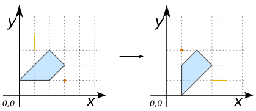

### Signature


GEOMETRY ST_FlipCoordinates(GEOMETRY geom);


### Description

Returns a version of the given geometry with `X` and `Y` axis flipped. 

Useful to flip `latitude/longitude` coordinates.

### Remark

This is a 2D function. So the `Z` value is returned with no modification.

### Examples

##### Cases with a simple `GEOMETRY`


SELECT ST_FlipCoordinates('POINT(1 2)');
-- Answer: POINT (2 1)

SELECT ST_FlipCoordinates('LINESTRING(1 2, 3 3, 5 9)');
-- Answer: LINESTRING (2 1, 3 3, 9 5)

SELECT ST_FlipCoordinates('POLYGON ((0 1, 2 3, 3 2, 2 1, 0 1))');
-- Answer: POLYGON ((1 0, 3 2, 2 3, 1 2, 1 0))


#### Case with a `Z` coordinate

SELECT ST_FlipCoordinates('POINT(1 2 5)');
-- Answer: POINT (2 1 5)


##### Case with a `MULTIGEOMETRY`


SELECT ST_FlipCoordinates('MULTIPOLYGON(((1 0, 1 3, 2 1, 1 0)), 
  					((1 4, 3 1, 3 4, 1 4)))');
-- Answer: MULTIPOLYGON(((0 1, 3 1, 1 2, 0 1)), 
--			((4 1, 1 3, 4 3, 4 1)))


##### Case with a `GEOMETRYCOLLECTION`


SELECT ST_FlipCoordinates('GEOMETRYCOLLECTION (
			POINT (3 1), 
			LINESTRING (1 4, 1 3), 
			POLYGON ((0 1, 2 3, 3 2, 2 1, 0 1)))');
-- Answer: GEOMETRYCOLLECTION(POINT (1 3), 
--			      LINESTRING (4 1, 3 1), 
--			      POLYGON ((1 0, 3 2, 2 3, 1 2, 1 0)))


##### See also

* [`ST_Reverse`](../ST_Reverse)
* <a href="https://github.com/irstv/H2GIS/blob/d6e7e2e6782322777208c5f62c2fe91d3d4d8186/h2spatial-ext/src/main/java/org/h2gis/h2spatialext/function/spatial/edit/ST_FlipCoordinates.java" target="_blank">Source code</a>
