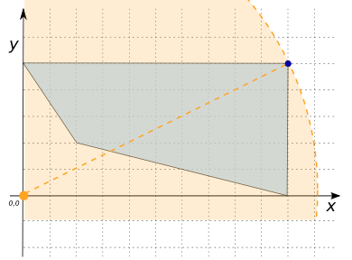
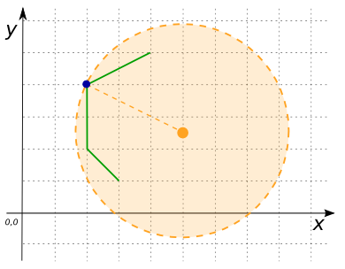

### Signatures


POINT ST_FurthestCoordinate(POINT 'POINT(x y)', GEOMETRY geom);
MULTIPOINT ST_FurthestCoordinate(POINT 'POINT(x y)', GEOMETRY geom);


### Description
`ST_FurthestCoordinate` computes the furthest coordinate(s) contained in the given `GEOMETRY` starting from the given `POINT`, using the 2D distance. If the coordinate is unique, it is returned as a `POINT`. If it is not, then all furthest coordinates are returned in a `MULTIPOINT`.

### Examples


SELECT ST_FurthestCoordinate('POINT(0 0)', 
    'POLYGON((2 2, 10 0, 10 5, 0 5, 2 2))');
-- Answer: POINT(10 5)



SELECT ST_FurthestCoordinate('POINT(5 2.5)', 
    'LINESTRING (3 1, 2 2, 2 4, 4 5)');
-- Answer: POINT(2 4)



SELECT ST_FurthestCoordinate('POINT(5 2.5)', 
    'POLYGON((0 0, 10 0, 10 5, 0 5, 0 0))');
-- Answer: MULTIPOINT((10 5), (0 0), (0 5), (10 0))


##### See also

* [`ST_ClosestCoordinate`](../ST_ClosestCoordinate)
* <a href="https://github.com/irstv/H2GIS/blob/master/h2spatial-ext/src/main/java/org/h2gis/h2spatialext/function/spatial/distance/ST_FurthestCoordinate.java" target="_blank">Source code</a>
