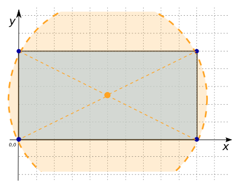

### Signatures


{POINT,MULTIPOINT} ST_FurthestCoordinate(POINT point, GEOMETRY geom);


### Description

Returns the coordinate of `geom` furthest from `point` using 2D distances
(z-coordinates are ignored).



### Examples


SELECT ST_FurthestCoordinate('POINT(0 0)', 
                             'POLYGON((2 2, 10 0, 10 5, 0 5, 2 2))');
-- Answer: POINT(10 5)



SELECT ST_FurthestCoordinate('POINT(5 2.5)', 
                             'LINESTRING(3 1, 2 2, 2 4, 4 5)');
-- Answer: POINT(2 4)



SELECT ST_FurthestCoordinate('POINT(5 2.5)', 
                             'POLYGON((0 0, 10 0, 10 5, 0 5, 0 0))');
-- Answer: MULTIPOINT((10 5), (0 0), (0 5), (10 0))


##### See also

* [`ST_ClosestCoordinate`](../ST_ClosestCoordinate)
* <a href="https://github.com/irstv/H2GIS/blob/master/h2spatial-ext/src/main/java/org/h2gis/h2spatialext/function/spatial/distance/ST_FurthestCoordinate.java" target="_blank">Source code</a>
* Added: <a href="https://github.com/irstv/H2GIS/pull/62" target="_blank">#62</a>
