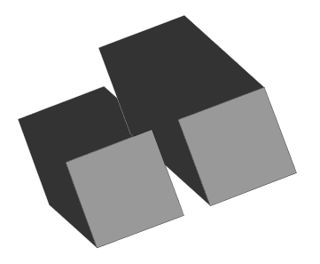
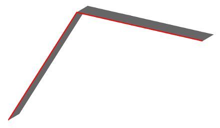
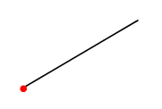

### Signature


ST_GeometryShadow(GEOMETRY geom, GEOMETRY point, DOUBLE height)
ST_GeometryShadow(GEOMETRY geom, DOUBLE azimuth, DOUBLE altitude,
                                 DOUBLE height)
ST_GeometryShadow(GEOMETRY geom, DOUBLE azimuth, DOUBLE altitude,
                                 DOUBLE height, BOOLEAN unify)


### Description

This function computes the shadow footprint as a `POLYGON`(s) for a `LINESTRING` and a `POLYGON` or as a `LINESTRING` for a `POINT`.

Avalaible arguments are :
 
* `geom`: the geometry used to compute the shadow,

* `azimuth` and `altitude`: the position of the sun (parameters exprimed in radians). See [ST_SunPosition](../ST_SunPosition) for more details,

* The `height` value is used to extrude the facades of the geometry,

* `unifiy`: optional parameter to unify or not the shadow polygons. True is the default value.

    <h5>This function does not work on <code>MULTI</code>geometries or <code>GEOMETRYCOLLECTION</code>s</h5>

### Remarks
* The `z` of the output `geometry` is set to 0,

* The `azimuth` is a direction along the horizon, measured from north to east. The `altitude` is expressed above the horizon in radians, e.g. 0 at the horizon and PI/2 at the zenith. The user can set the azimut and the altitude using a point. See [ST_SunPosition](../ST_SunPosition) function. The folowing signature must be used:


ST_GeometryShadow(INPUT_GEOM,ST_SunPosition(), HEIGHT).


### Examples

#### Cases with a `POLYGON`

Where we specify the `point` *(1st signature)*

SELECT ST_Geometryshadow('POLYGON((356090.9 6693096.6, 356132.1 6693112.3, 356147.4 6693071.3, 356105.8 6693055.8, 356090.9 6693096.6))', 
                         'POINT (4.180164851770003 0.6085954108606529)', 4);


Where `azimuth` and `altitude` are specified *(2nd signature)*

SELECT ST_Geometryshadow('POLYGON((356090.9 6693096.6, 356132.1 6693112.3, 356147.4 6693071.3, 356105.8 6693055.8, 356090.9 6693096.6))', 
                         4.180164851770003, 0.6085954108606529, 4);


Where `azimuth`, `altitude` and `unify` are specified *(3rd signature)*

SELECT ST_Geometryshadow('POLYGON((356090.9 6693096.6, 356132.1 6693112.3, 356147.4 6693071.3, 356105.8 6693055.8, 356090.9 6693096.6))', 
                         4.180164851770003, 0.6085954108606529, 4, 1);


Answer (for the 3 previous queries): 

POLYGON ((356090.9 6693096.6 0, 356095.8462871666 6693099.512910977 0, 356137.04628716654 6693115.212910977 0, 356152.3462871666 6693074.212910977 0, 356147.4 6693071.3 0, 356147.04946721025 6693072.239336234 0, 356147.0494672103 6693072.239336234 0, 356132.1 6693112.3 0, 356096.1758584912 6693098.610460638 0, 356096.1758584913 6693098.610460638 0, 356090.9 6693096.6 0)) 


Including the [ST_SunPosition](../ST_SunPosition) function:


SELECT ST_Geometryshadow('POLYGON((356090.9 6693096.6, 356132.1 6693112.3, 356147.4 6693071.3, 356105.8 6693055.8, 356090.9 6693096.6))', 
                          ST_SunPosition('POINT(-1.54544 47.24961)'), 4);
-- Answer: POLYGON ((356090.9 6693096.6 0, 356095.8462871666 6693099.512910977 0, 356137.04628716654 6693115.212910977 0, 356152.3462871666 6693074.212910977 0, 356147.4 6693071.3 0, 356147.04946721025 6693072.239336234 0, 356147.0494672103 6693072.239336234 0, 356132.1 6693112.3 0, 356096.1758584912 6693098.610460638 0, 356096.1758584913 6693098.610460638 0, 356090.9 6693096.6 0)) 

-- or with a specific date
SELECT ST_Geometryshadow('POLYGON((356090.9 6693096.6, 356132.1 6693112.3, 356147.4 6693071.3, 356105.8 6693055.8, 356090.9 6693096.6))', 
                          ST_SunPosition('POINT(-1.54544 47.24961)',
                                         '2015-01-30 10:00:00+01:00'), 4);
-- Answer: POLYGON ((356075.6292365097 6693110.336145673 0, 356116.8292365096 6693126.036145673 0, 356132.1 6693112.3 0, 356090.9 6693096.6 0, 356099.5554154004 6693072.899265212 0, 356099.5554154005 6693072.899265212 0, 356105.8 6693055.8 0, 356090.52923650964 6693069.536145673 0, 356075.6292365097 6693110.336145673 0))


Computes shadow on polygons that are in a table and which height is stored in a field.


CREATE TABLE building (geom geometry, height double);
INSERT INTO building values('POLYGON((356090.9 6693096.6, 356132.1 6693112.3, 356147.4 6693071.3, 356105.8 6693055.8, 356090.9 6693096.6))', 6);
INSERT INTO building values('POLYGON((356160 6693075.8, 356144.7 6693116.9, 356185.8 6693132.4, 356201.2 6693091.6, 356160 6693075.8))', 10);

-- Then computes the polygon's shadows
SELECT ST_Geometryshadow(geom, ST_SunPosition('POINT(-1.54544 47.24961)','2015-01-30 10:00:00+01:00'), height) FROM building;

-- Answer: 
-- POLYGON ((356067.9938547645 6693117.20421851 0, 356109.19385476445 6693132.90421851 0, 356132.1 6693112.3 0, 356090.9 6693096.6 0, 356096.43312310067 6693081.448897818 0, 356096.4331231008 6693081.448897818 0, 356105.8 6693055.8 0, 356082.89385476446 6693076.40421851 0, 356067.9938547645 6693117.20421851 0)) 
-- POLYGON ((356106.5230912742 6693151.240364184 0, 356147.6230912742 6693166.740364184 0, 356185.8 6693132.4 0, 356144.7 6693116.9 0, 356160 6693075.8 0, 356121.8230912742 6693110.140364183 0, 356106.5230912742 6693151.240364184 0)) 


#### Case with a `LINESTRING`


-- Using the 2nd signature
SELECT ST_Geometryshadow('LINESTRING(356109 6693060, 356140 6693109, 356197 6693096)', 
                          4.180164851770003, 0.6085954108606529, 4);

-- Answer: POLYGON ((356109 6693060 0, 356140 6693109 0, 356144.94628716656 6693111.912910977 0, 356201.94628716656 6693098.912910977 0, 356197 6693096 0, 356142.7120983602 6693108.381451251 0, 356113.94628716656 6693062.912910977 0, 356109 6693060 0))


#### Case with a `POINT`


-- Using the 2nd signature
SELECT ST_Geometryshadow('POINT(356140 6693109)', 
                          4.180164851770003, 0.6085954108606529, 4);

-- Answer: LINESTRING (356140 6693109 0, 356144.94628716656 6693111.912910977 0) 


### Use case
A specific use case, using `ST_SunPosition` and `ST_GeometryShadow` is avalaible [HERE](https://github.com/orbisgis/h2gis/wiki/3.3-Compute-building's-shadow).

##### See also

* [`ST_SunPosition`](../ST_SunPosition),  [`ST_ISOVist`](../ST_ISOVist)
* <a href="https://github.com/orbisgis/h2gis/blob/master/h2gis-functions/src/main/java/org/h2gis/functions/spatial/earth/ST_GeometryShadow.java" target="_blank">Source code</a>
