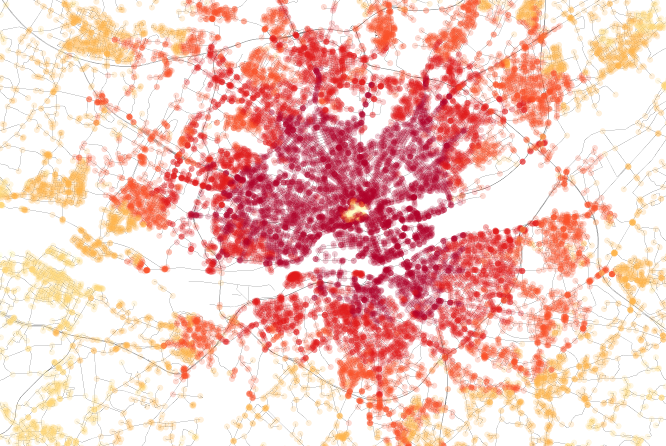
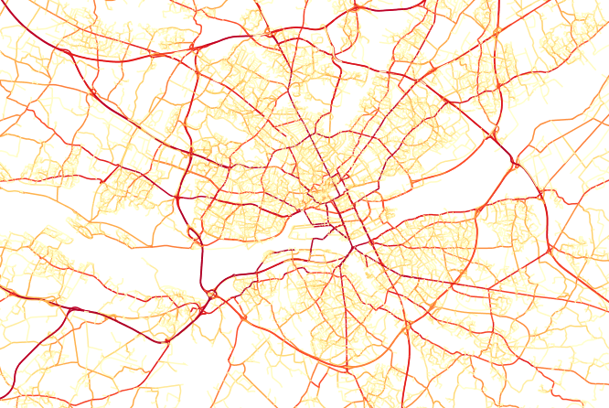
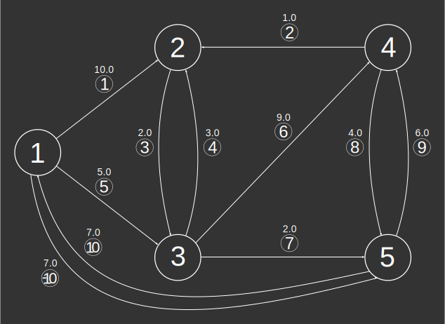
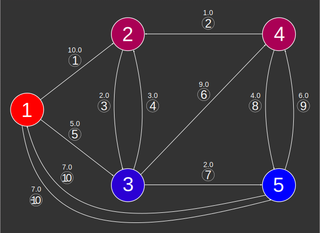
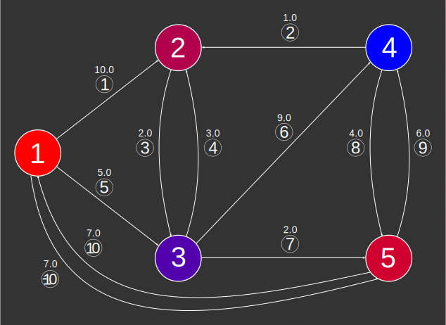

### Signatures


-- Creates two tables:
--     INPUT_EDGES_NODE_CENT[NODE_ID, BETWEENNESS, CLOSENESS]
--     INPUT_EDGES_EDGE_CENT[EDGE_ID, BETWEENNESS]
ST_GraphAnalysis('INPUT_EDGES', 'o[ - eo]'[, 'w']);


### Description

Uses [Brande's betweenness centrality algorithm][brandes] to
calculate closeness and betweenness [centrality][wiki] for vertices
and betweenness centrality for edges.

Let $$d(s, t)$$ denote the **distance** from $$s \in V$$ to $$t \in
V$$, i.e., the minimum length of all paths connecting $$s$$ to
$$t$$. We have $$d(s, s) = 0$$ for all $$s \in V$$.

Let $$\sigma_{st}$$ denote the number of shortest paths from $$s \in
V$$ to $$t \in V$$ and set $$\sigma_{ss}=1$$ by convention. Let
$$\sigma_{st}(v)$$ denote the number of shortest paths from $$s$$ to
$$t$$ containing $$v \in V$$.

We have the following definitions for vertices:

\begin{array}{l r}
    C_C(v) = \left(\sum_{t \in V} d(v, t)\right)^{-1}
    & \qquad \textrm{closeness centrality} \\
    C_B(v) = \sum_{s \neq t \neq v \in V} \frac{\sigma_{st}(v)}{\sigma_{st}}
    & \qquad \textrm{betweenness centrality} \\
\end{array}

Betweenness centrality for edges is defined similarly.

A high closeness centrality score indicates that a vertex can reach
other vertices on relatively short paths; a high betweenness
centrality score indicates that a vertex lies on a relatively high
number of shortest paths.

  <h5>All centrality scores are normalized.</h5>
  
But this normalization depends on the graph being connected.
  Use <a
  href="../ST_ConnectedComponents"><code>ST_ConnectedComponents</code></a>
  to make sure you're calling <code>ST_GraphAnalysis</code> on a
  single (strongly) connected component.

  <h5>A few caveats.</h5>
  
 Results will not be accurate if the graph:
  <ul>
  <li> contains "duplicate" edges (having the same source,
  destination and weight)
  </li>
  <li> is disconnected. If all closeness centrality scores are zero,
  this is why.
  </li>
  </ul>
  

##### Input parameters

| Variable      | Meaning                                                                                                                                                                               |
|---------------|---------------------------------------------------------------------------------------------------------------------------------------------------------------------------------------|
| `INPUT_EDGES` | Edges table produced by `ST_Graph` from table `input`                                                                                                                                 |
| `o`           | Global orientation string: `directed`, `reversed` or `undirected`                                                                                                                     |
| `eo`          | Edge orientation column name indicating individual edge orientations: `1` (directed), `-1` (reversed) or `0` (undirected); required if global orientation is `directed` or `reversed` |
| `w`           | Edge weights column name                                                                                                                                                              |

##### Screenshots

Closeness centrality of Nantes, France. Notice the limited traffic
zone in the center.

Edge betweenness centrality of Nantes, France. Notice how the
beltway and bridges really stand out.

The above screenshots were generated in [OrbisGIS][og].

### Examples


-- We will do graph analysis on the largest strongly connected
-- component of the directed weighted graph examined in
-- ST_ShortestPath examples, illustrated below.
SELECT * FROM EDGES_EO_W_SCC;
-- | EDGE_ID | START_NODE | END_NODE | WEIGHT | EDGE_ORIENTATION |
-- |---------|------------|----------|--------|------------------|
-- |       1 |          1 |        2 |   10.0 |                1 |
-- |       2 |          2 |        4 |    1.0 |               -1 |
-- |       3 |          2 |        3 |    2.0 |                1 |
-- |       4 |          3 |        2 |    3.0 |                1 |
-- |       5 |          1 |        3 |    5.0 |                1 |
-- |       6 |          3 |        4 |    9.0 |                1 |
-- |       7 |          3 |        5 |    2.0 |                1 |
-- |       8 |          4 |        5 |    4.0 |                1 |
-- |       9 |          5 |        4 |    6.0 |                1 |
-- |      10 |          5 |        1 |    7.0 |                0 |



-- Do the graph analysis.
CALL ST_GraphAnalysis('EDGES_EO_W_SCC',
    'directed - EDGE_ORIENTATION', 'WEIGHT');
-- The results for nodes:
SELECT * FROM EDGES_EO_W_SCC_NODE_CENT;
-- | NODE_ID |        BETWEENNESS |           CLOSENESS |
-- |---------|--------------------|---------------------|
-- |       1 |                0.0 | 0.12121212121212122 |
-- |       2 | 0.3333333333333333 | 0.14814814814814814 |
-- |       3 | 0.8333333333333334 | 0.18181818181818182 |
-- |       4 | 0.3333333333333333 | 0.21052631578947367 |
-- |       5 |                1.0 | 0.13793103448275862 |

-- We use linear interpolation from red (0) to blue (1) to
-- illustrate node betweenness.
SELECT NODE_ID,
       BETWEENNESS,
       CAST(255*(1-BETWEENNESS) AS INT) RED,
       CAST(255*BETWEENNESS AS INT) BLUE
    FROM EDGES_EO_W_SCC_NODE_CENT
    ORDER BY BETWEENNESS DESC;
-- | NODE_ID |        BETWEENNESS |                 RED | BLUE |
-- |---------|--------------------|---------------------|------|
-- |       5 |                1.0 |                   0 |  255 |
-- |       3 | 0.8333333333333334 |                  42 |  213 |
-- |       4 | 0.3333333333333333 |                 170 |   85 |
-- |       2 | 0.3333333333333333 |                 170 |   85 |
-- |       1 |                0.0 |                 255 |    0 |



-- We use linear interpolation from red (0) to blue (1) to
-- illustrate closeness.
SELECT NODE_ID,
       CLOSENESS,
       CLOSE_INTERP,
       CAST(255*(1-CLOSE_INTERP) AS INT) RED,
       CAST(255*CLOSE_INTERP AS INT) BLUE
   FROM (SELECT NODE_ID,
                CLOSENESS,
                (CLOSENESS -
                    (SELECT MIN(CLOSENESS) FROM EDGES_EO_W_SCC_NODE_CENT)) /
                ((SELECT MAX(CLOSENESS) FROM EDGES_EO_W_SCC_NODE_CENT) -
                    (SELECT MIN(CLOSENESS) FROM EDGES_EO_W_SCC_NODE_CENT))
                AS CLOSE_INTERP
         FROM EDGES_EO_W_SCC_NODE_CENT)
    ORDER BY CLOSENESS DESC;
-- | NODE_ID |           CLOSENESS |        CLOSE_INTERP |  RED | BLUE |
-- |---------|---------------------|---------------------|------|------|
-- |       4 | 0.21052631578947367 |                 1.0 |    0 |  255 |
-- |       3 | 0.18181818181818182 |  0.6785714285714287 |   82 |  173 |
-- |       2 | 0.14814814814814814 |  0.3015873015873015 |  178 |   77 |
-- |       5 | 0.13793103448275862 | 0.18719211822660095 |  207 |   48 |
-- |       1 | 0.12121212121212122 |                 0.0 |  255 |    0 |



-- The results for edges:
SELECT * FROM EDGES_EO_W_SCC_EDGE_CENT ORDER BY BETWEENNESS DESC;
-- | EDGE_ID |         BETWEENNESS |
-- |---------|---------------------|
-- |       7 |                 1.0 |
-- |       9 |  0.8571428571428571 |
-- |       3 |  0.8571428571428571 |
-- |      10 |  0.5714285714285714 |
-- |       2 |  0.5714285714285714 |
-- |       5 | 0.42857142857142855 |
-- |       4 |  0.2857142857142857 |
-- |       8 |  0.2857142857142857 |
-- |     -10 | 0.14285714285714285 |
-- |       1 |                 0.0 |
-- |       6 |                 0.0 |


##### See also

* [`ST_ConnectedComponents`](../ST_ConnectedComponents)
* <a href="https://github.com/irstv/H2GIS/blob/master/h2network/src/main/java/org/h2gis/network/graph_creator/ST_GraphAnalysis.java" target="_blank">Source code</a>

[wiki]: http://en.wikipedia.org/wiki/Centrality
[brandes]: http://www.inf.uni-konstanz.de/algo/publications/b-fabc-01.pdf
[og]: http://www.orbisgis.org
