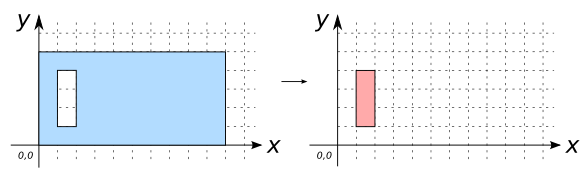

### Signatures


GEOMETRYCOLLECTION ST_Holes(GEOMETRY geom)
GEOMETRYCOLLECTION ST_Holes(GEOMETRYCOLLECTION geom)


### Description

Returns `geom`'s holes as a `GEOMETRYCOLLECTION`.

Returns `GEOMETRYCOLLECTION EMPTY` for Geometries of dimension less than 2.

### Examples


SELECT ST_Holes('POLYGON ((0 0, 10 0, 10 5, 0 5, 0 0))');
-- Answer: GEOMETRYCOLLECTION EMPTY

SELECT ST_Holes('POLYGON ((0 0, 10 0, 10 5, 0 5, 0 0),
                          (1 1, 2 1, 2 4, 1 4, 1 1))');
-- Answer: GEOMETRYCOLLECTION(POLYGON((1 1, 2 1, 2 4, 1 4, 1 1)))



SELECT ST_Holes(
    'GEOMETRYCOLLECTION(
       POLYGON ((0 0, 10 0, 10 5, 0 5, 0 0),
                (1 1, 2 1, 2 4, 1 4, 1 1)),
       POLYGON ((11 6, 14 6, 14 9, 11 9, 11 6),
                (12 7, 14 7, 14 8, 12 8, 12 7)))');
-- Answer: GEOMETRYCOLLECTION(
--           POLYGON((1 1, 2 1, 2 4, 1 4, 1 1)),
--           POLYGON((12 7, 14 7, 14 8, 12 8, 12 7)))



SELECT ST_Holes('LINESTRING(5 5, 1 2, 3 4, 9 3)');
-- Answer: GEOMETRYCOLLECTION EMPTY


##### See also

* <a href="https://github.com/irstv/H2GIS/blob/master/h2spatial-ext/src/main/java/org/h2gis/h2spatialext/function/spatial/convert/ST_Holes.java" target="_blank">Source code</a>
* Added: <a href="https://github.com/irstv/H2GIS/pull/52" target="_blank">#52</a>
