### Signature


GEOMETRY ST_ISOVIST(GEOMETRY point, GEOMETRY obstacles, 
	DOUBLE maxDistance)
GEOMETRY ST_ISOVIST(GEOMETRY point, GEOMETRY obstacles, 
	DOUBLE maxDistance, DOUBLE angleStart, DOUBLE angleStop)


### Description

This function compute the visibility polygon obstructed by provided `obstacles`. 

`Obstacles` can be `LINESTRING(S)` ,`POLYGON(S)`  or `GEOMETRYCOLLECTION(S)`. 

Resulting polygon will be enclosed by a circle defined by the maximum distance (`maxDistance`) parameter.

##### Parameters

* `point` : Point coordinates (x, y, (z)) from which the visibility will be calculated,
* `obstacles` : Geometry or set of geometries grouped into a simple or complex geometry, used as obstacles,
* `maxDistance` : Only obstacles located within this distance from the `point` are considered in the calculation *(only cartesian distance is accepted - depends on your spatial ref)*,
* `angleStart` : Starting angle from which visibility will be calculated *(exprimed in radian - to convert from degree, use the H2 database [PI()](http://h2database.com/html/functions.html#pi) function)*,
* `angleStop` : Ending angle from which visibility will be calculated *(exprimed in radian)*.


### Examples

#### Initialize input geometries

* point where the visibility will be computed : ```point``` layer
* buildings : ```polygon``` layer
* walls : ```linestring``` layer
* buildings and walls : ```geomCollection``` layer


DROP TABLE IF EXISTS point, polygon, linestring, geomcollection;

CREATE TABLE point AS SELECT ST_GEOMFROMTEXT('POINT (28.20 59.11)') as geom;

CREATE TABLE polygon AS SELECT ST_GEOMFROMTEXT('
	MULTIPOLYGON (((87.1 39 0, 90.8 28.8 0, 80.8 25.3 0, 75.4 40.7 0, 83.1 43.5 0, 87.1 39 0)), ((70.3 67.2 0, 76.3 51.9 0, 79.2 53.1 0, 81.9 46.1 0, 75.3 43.6 0, 72.6 50.5 0, 68 48.6 0, 61.9 63.9 0, 70.3 67.2 0)), ((68 33.6 0, 64.8 32.5 0, 62.3 39 0, 69.1 41.4 0, 70.7 34.8 0, 68 33.6 0)), ((65.4 31.2 0, 69 21.9 0, 55.1 16.3 0, 51.5 25.7 0, 65.4 31.2 0)), ((59.6 85.6 0, 63.4 75.6 0, 54.8 72.5 0, 51.1 82.2 0, 59.6 85.6 0)), 
  ((62 38.3 0, 62.9 36.1 0, 58.8 34.5 0, 57.9 36.7 0, 62 38.3 0)), ((40.4 95.4 0, 39.7 95.3 0, 38.1 99.4 0, 49.1 103.4 0, 55.8 87.4 0, 32.5 78 0, 30.4 82.9 0, 43.3 88 0, 40.4 95.4 0)), ((43.5 64.9 0, 52.2 46.1 0, 50.4 45.3 0, 51.2 43.1 0, 48.7 42.2 0, 46.4 48.5 0, 45.7 48.2 0, 38.7 63.1 0, 43.5 64.9 0)), ((47.2 33.7 0, 49 29.1 0, 46.3 28 0, 44.4 32.8 0, 47.2 33.7 0)), ((25 19.9 0, 28.3 21 0, 28.8 19.1 0, 32.2 20.2 0, 32.8 18.6 0, 43.3 22.1 0, 46.2 13.3 0, 42.6 11.9 0, 42.1 12.9 0, 38.5 11.7 0, 38.6 11 0, 35.5 9.9 0, 35.9 8.8 0, 29.4 7.3 0, 25 19.9 0)), ((43 52.2 0, 44.6 48.4 0, 41.2 47.2 0, 38 47 0, 36.9 49.7 0, 43 52.2 0)), 
  ((24.7 25.6 0, 20.7 37.5 0, 28.3 40.3 0, 31.3 31.5 0, 33.2 32.3 0, 34.4 29.2 0, 24.7 25.6 0)), ((18.2 83.9 0, 16.4 88.4 0, 26.3 92.5 0, 30.1 83.5 0, 16.5 78.2 0, 14.7 82.5 0, 18.2 83.9 0)), ((11.3 21 0, 10 24.9 0, 15.7 27.1 0, 17.2 23 0, 22.6 24.9 0, 23.7 22 0, 20 20.8 0, 19.6 22 0, 17.6 21.4 0, 17 22.9 0, 11.3 21 0)), ((19.3 19.9 0, 21.5 10.5 0, 8.2 7.3 0, 7.2 11.8 0, 9.3 12.3 0, 7.8 19.4 0, 16.1 21.1 0, 18.1 21.2 0, 18.5 19.7 0, 19.3 19.9 0)), ((8.3 64 0, 4.6 74.2 0, 13.8 77.7 0, 17.7 67.4 0, 14.8 66.4 0, 18.7 56 0, 12.2 53.4 0, 8.3 64 0)), ((14 50.8 0, 14.9 48.4 0, 9.6 46.6 0, 12.1 39.1 0, 6 36.9 0, 2.7 46.9 0, 14 50.8 0)))') as geom;

CREATE TABLE linestring AS SELECT ST_GEOMFROMTEXT('
	MULTILINESTRING ((54.8 72.5 0, 51.1 82.2 0), (51.1 82.2 0, 59.6 85.6 0), 
	(55.8 87.4 0, 32.5 78 0), (32.5 78 0, 30.4 82.9 0), (45.7 48.2 0, 38.7 63.1 0), 
	(38.7 63.1 0, 43.5 64.9 0), (20.7 37.5 0, 28.3 40.3 0), (30.1 83.5 0, 16.5 78.2 0), 
	(13.8 77.7 0, 17.7 67.4 0), (14.9 48.4 0, 9.6 46.6 0), (9.6 46.6 0, 12.1 39.1 0))') as geom;

CREATE TABLE geomcollection AS SELECT ST_GEOMFROMTEXT('GEOMETRYCOLLECTION(
	MULTIPOLYGON (((87.1 39 0, 90.8 28.8 0, 80.8 25.3 0, 75.4 40.7 0, 83.1 43.5 0, 87.1 39 0)), 
	((70.3 67.2 0, 76.3 51.9 0, 79.2 53.1 0, 81.9 46.1 0, 75.3 43.6 0, 72.6 50.5 0, 68 48.6 0, 61.9 63.9 0, 70.3 67.2 0)), 
	((68 33.6 0, 64.8 32.5 0, 62.3 39 0, 69.1 41.4 0, 70.7 34.8 0, 68 33.6 0)), 
	((65.4 31.2 0, 69 21.9 0, 55.1 16.3 0, 51.5 25.7 0, 65.4 31.2 0)), 
	((59.6 85.6 0, 63.4 75.6 0, 54.8 72.5 0, 51.1 82.2 0, 59.6 85.6 0)), 
	((62 38.3 0, 62.9 36.1 0, 58.8 34.5 0, 57.9 36.7 0, 62 38.3 0))), 
	MULTILINESTRING ((55.8 87.4 0, 32.5 78 0), (32.5 78 0, 30.4 82.9 0), (45.7 48.2 0, 38.7 63.1 0), 
	(13.8 77.7 0, 17.7 67.4 0), (14.9 48.4 0, 9.6 46.6 0), (9.6 46.6 0, 12.1 39.1 0)))') as geom;


#### Example with a distance

##### Using ```polygon```

Use buildings (```polygon```) to compute the visibility from the ```point``` with a distance of 20m.


DROP TABLE IF EXISTS isovist;
CREATE TABLE isovist AS 
  SELECT ST_ISOVIST(a.geom, b.geom, 20) as geom 
  FROM point a, polygon b;


**Result**

Legend : ```polygon``` in grey /  ```point``` in red / ```resulting ISOVist layer``` in orange

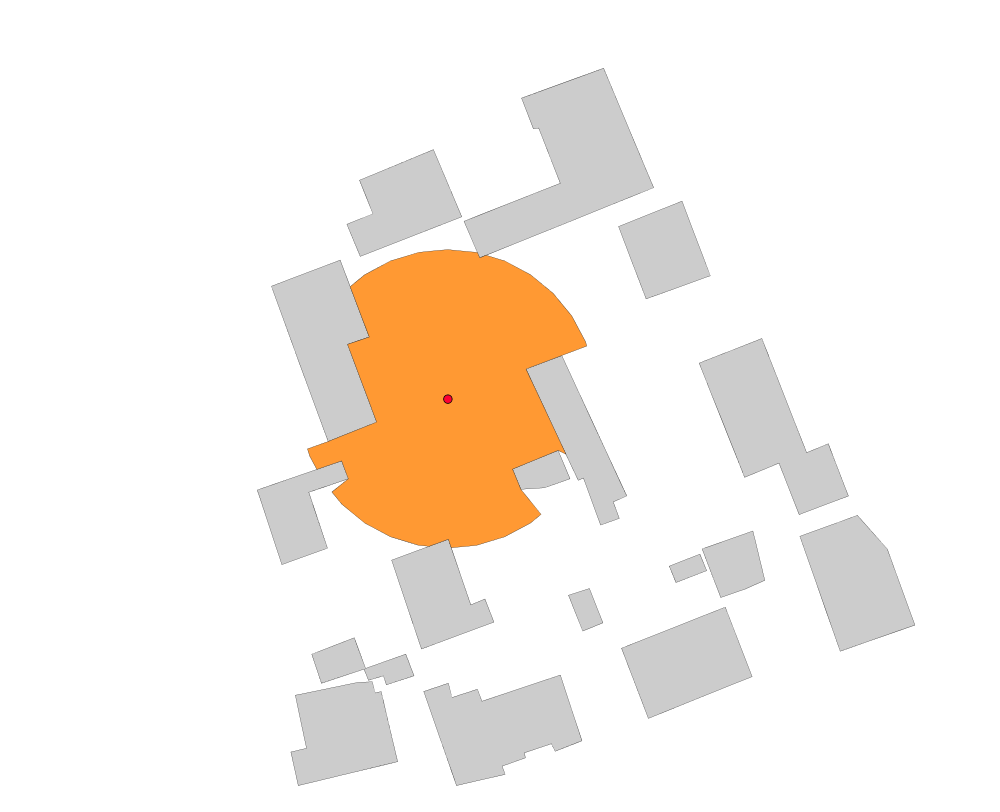

Same but with a distance of 50m.


DROP TABLE IF EXISTS isovist;
CREATE TABLE isovist AS 
  SELECT ST_ISOVIST(a.geom, b.geom, 50) as geom 
  FROM point a, polygon b;


**Result**

Legend : ```polygon``` in grey /  ```point``` in red / ```resulting ISOVist layer``` in orange

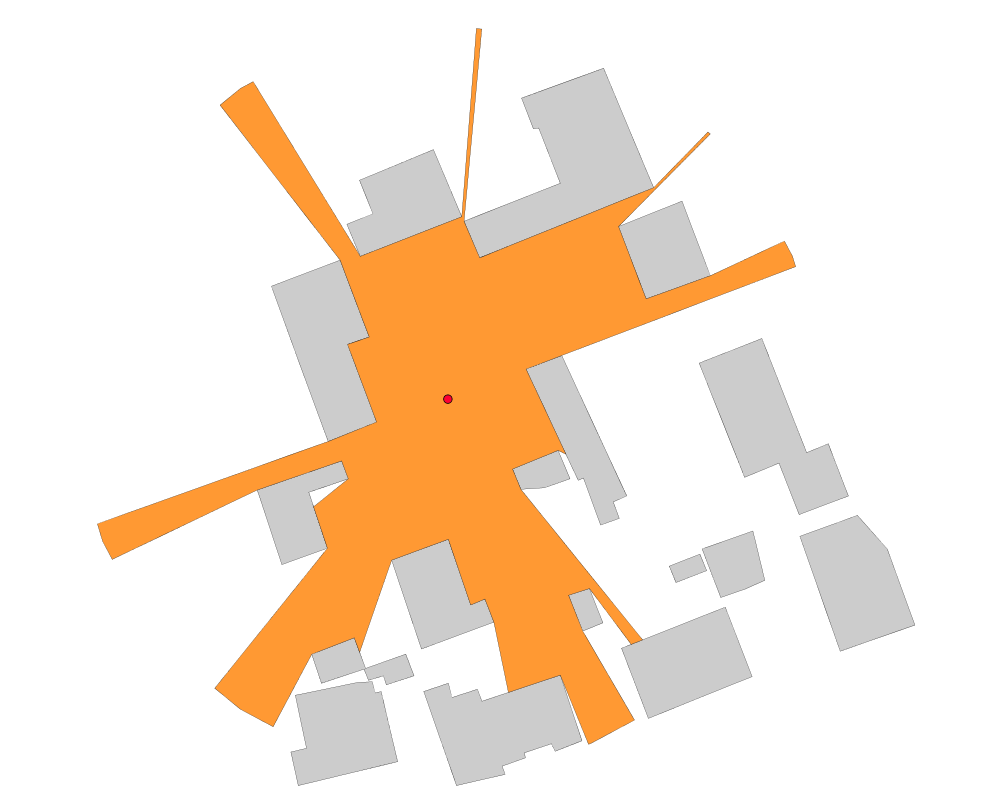


##### Using ```linestring```

Use walls (```linestring```) to compute the visibility from the ```point``` with a distance of 50m.


DROP TABLE IF EXISTS isovist;
CREATE TABLE isovist AS 
  SELECT ST_ISOVIST(a.geom, b.geom, 50) as geom 
  FROM point a, linestring b;


**Result**

Legend : ```walls``` in black /  ```point``` in red / ```resulting ISOVist layer``` in orange
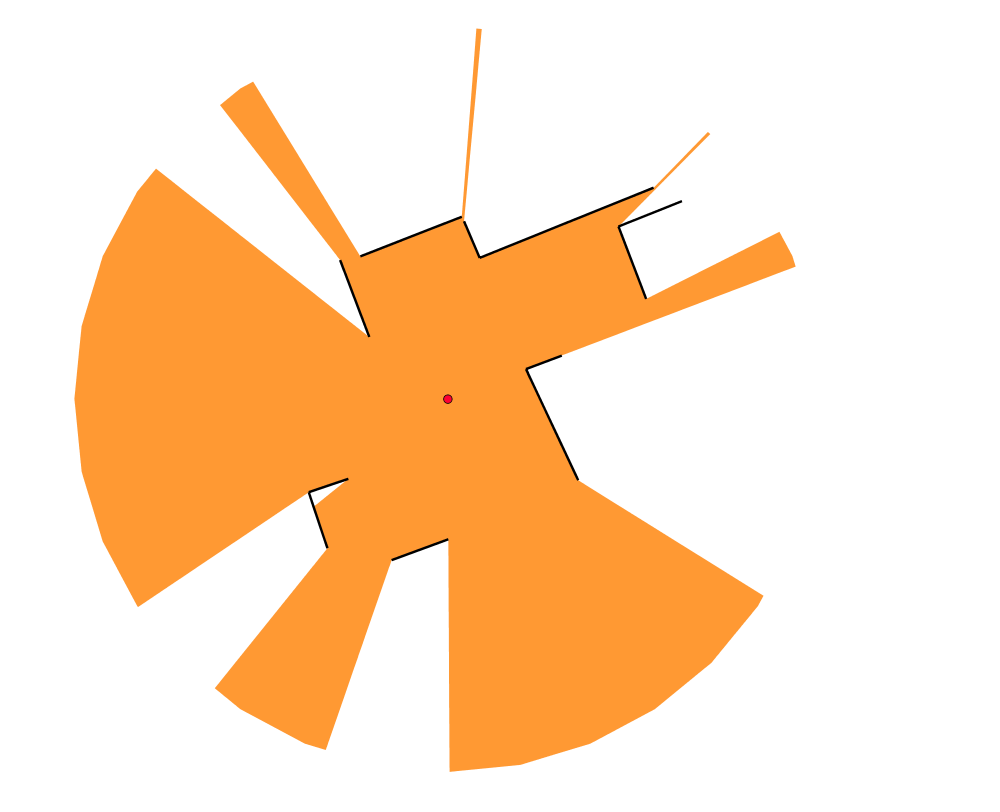

##### Using ```geomCollection```


DROP TABLE IF EXISTS isovist;
CREATE TABLE isovist AS 
  SELECT ST_ISOVIST(a.geom, b.geom, 50) as geom 
  FROM point a, geomcollection b;


**Result**

Legend : ```polygon``` in grey /  ```walls``` in black /  ```point``` in red / ```resulting ISOVist layer``` in orange
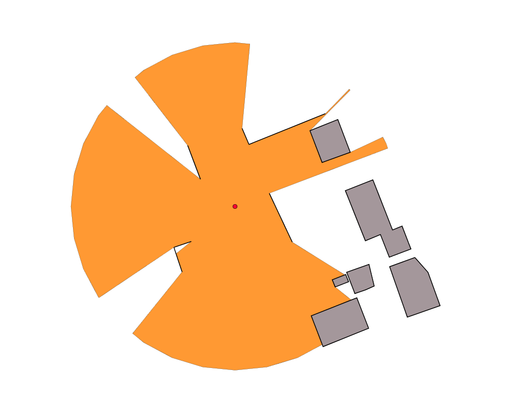

#### Example with starting and ending angles

Compute the visibility using buildings (```poygon``` layer) with a distance of 50m, starting at 0 rad and ending at 3 rad. 


DROP TABLE IF EXISTS isovist;
CREATE TABLE isovist AS 
  SELECT ST_ISOVIST(a.geom, b.geom, 50, 0, 3) as geom 
  FROM point a, polygon b;


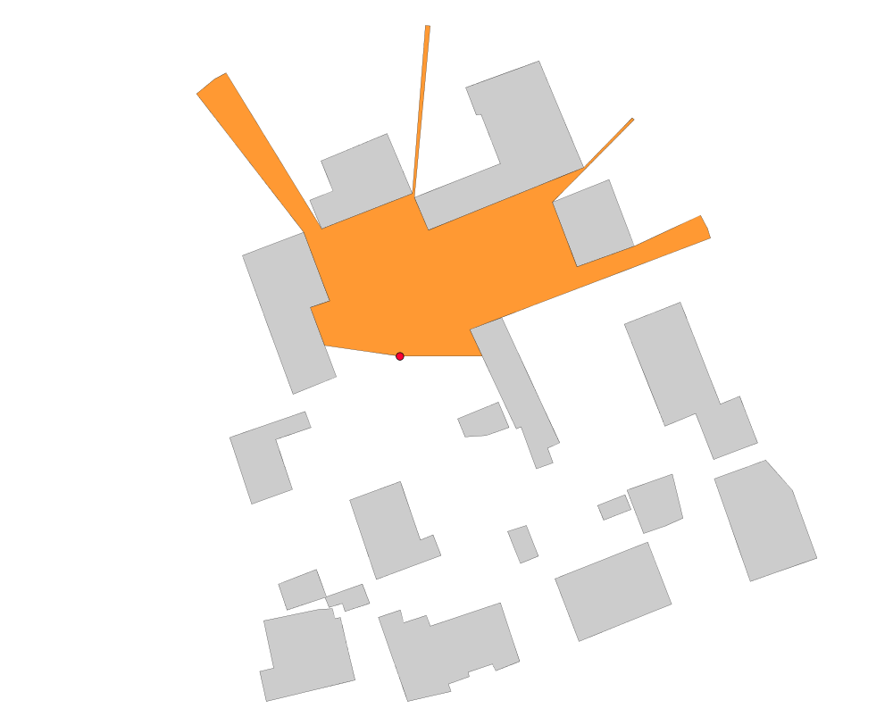

Same, but ending at 5 rad. 


DROP TABLE IF EXISTS isovist;
CREATE TABLE isovist AS 
  SELECT ST_ISOVIST(a.geom, b.geom, 50, 0, 5) as geom 
  FROM point a, polygon b;


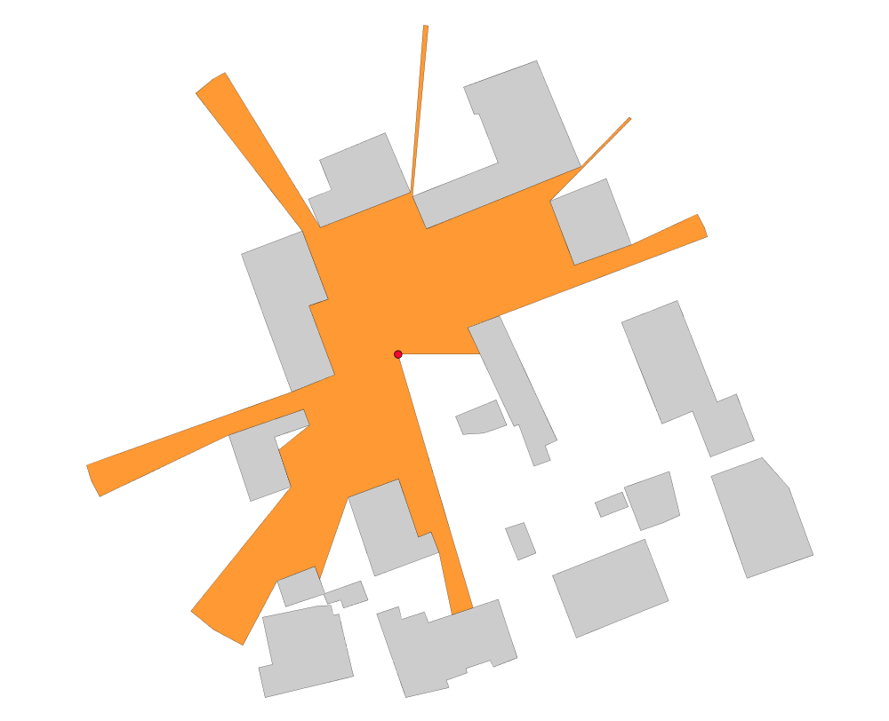

-----

#### Application : Compute visibility along a path 

##### Aim 
Compute visibilities in the city center of [Vannes](https://www.openstreetmap.org/#map=17/47.65908/-2.75922) (France), every 10m, with a 100m maximum distance of visibility and export results into an animated .gif file.

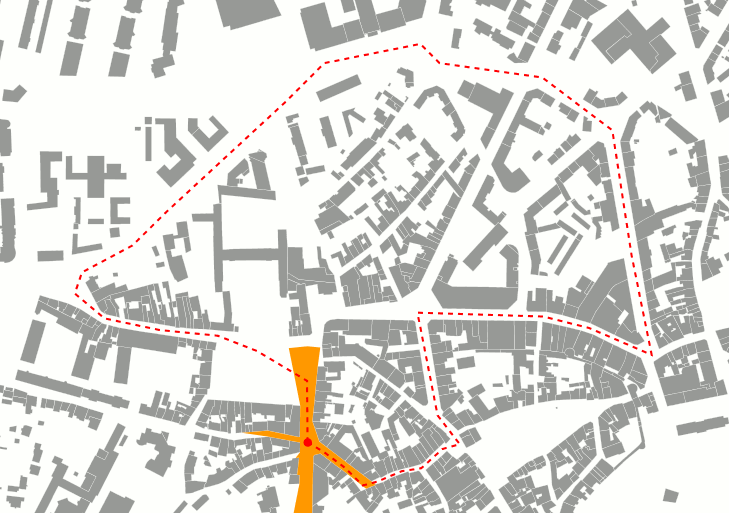

Cool isn't it? Thanks to H2GIS, [OrbisGIS](http://orbisgis.org/), [Groovy](http://www.groovy-lang.org/) and [The Gimp](https://www.gimp.org/) *(all free and open-source)* you will see that it's quite easy to reproduce.


##### How to produce this animation?

To do so, just follow these steps:

* 1- Prepare input data
* 2- Run the Groovy script
* 3- Convert all the images into an animated .gif

##### 1- Prepare input data

In this example, only two tables are needed:

* `buildings` : a set of `polygons` *(grey in the gif)*
* `path` : a `linestring`. If you want to do a loop (like in the .gif), your `linestring` has to be closed *(red in the gif)*.


[Load your data](http://doc.orbisgis.org/en/latest/users/quickstart.html#load-data) into OrbisGIS

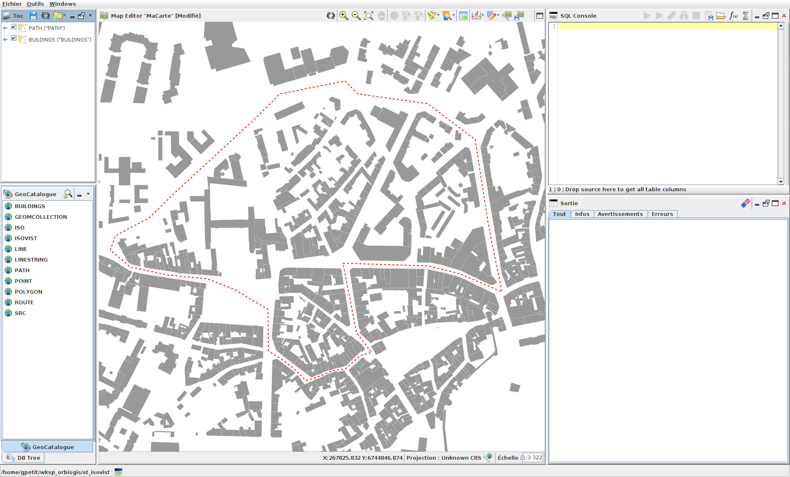

In the [SQL Console](http://doc.orbisgis.org/en/latest/users/script_sql.html), execute the following script.

DROP TABLE IF EXISTS src, iso;

CREATE TABLE src AS 
  SELECT ST_STARTPOINT(geom) as geom 
  FROM path;     

CREATE TABLE iso AS 
  SELECT ST_IsoVist(a.geom, ST_Accum(b.geom), 100) as geom 
  FROM src a, buildings b;


Where `ST_IsoVist(a.geom, ST_Accum(b.geom), 100)` &rarr; `100` is the maxDistance value used in this example.

This script will creates:

* the first *(starting)* point of your `path` (`src` layer),
* the ISOVist (`iso` layer) from the first point. 

Once executed, load `src` and `iso` layers into the `TOC` and adapt their styles to fit to your needs *(here red point and orange polygon)*.

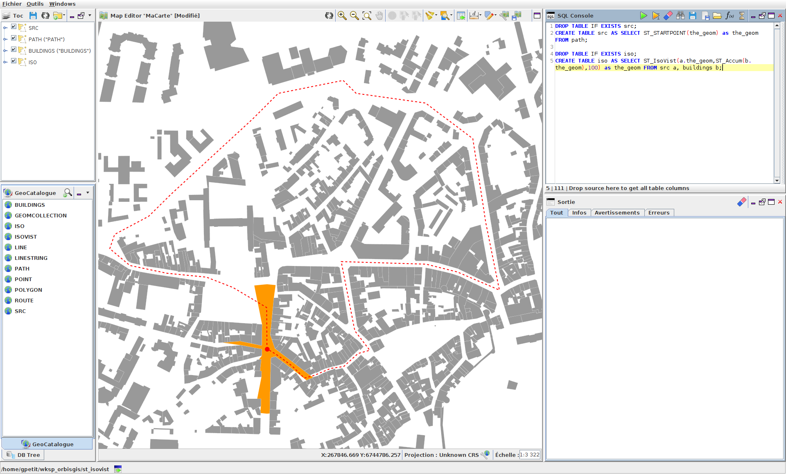


##### 2- Run the Groovy script

In the OrbisGIS's [Groovy Console](http://doc.orbisgis.org/en/latest/users/script_groovy.html), execute the script presented below.

In a nutshell, this script will:

* densify the path in order to obtain a set of points that will be used to compute visibilities,
* for each point, compute the visibility and export the map into a .png file.


import org.orbisgis.core_export.MapImageWriter;
import java.awt.Color;

MapImageWriter mapImageWriter = new MapImageWriter(mc.getLayerModel());
mapImageWriter.setPixelSize(MapImageWriter.MILLIMETERS_BY_INCH / 72);
mapImageWriter.setFormat(MapImageWriter.Format.PNG);
mapImageWriter.setBoundingBox(mc.getBoundingBox());
mapImageWriter.setWidth(729);
mapImageWriter.setHeight(513);
mapImageWriter.setBackgroundColor(Color.WHITE);

for(int i=1;i<=256;i+=1) {
 sql.execute '''
  DROP TABLE IF EXISTS src;
  CREATE TABLE src AS SELECT ST_PointN(ST_Densify(geom, 10), '''+i+''') geom FROM path;     
  DROP TABLE IF EXISTS iso;
  CREATE TABLE iso AS SELECT ST_IsoVist((SELECT ST_PointN(ST_Densify(geom, 10), '''+i+''') geom FROM path), ST_Accum(geom), 100) geom FROM buildings;'''

 FileOutputStream fileOutputStream = new FileOutputStream("/myUrl/"+"test"+i+".png");
 mapImageWriter.write(fileOutputStream, null);
 fileOutputStream.close();
}


Where

* `mapImageWriter.setWidth(729)` and `setHeight(513)` defines the size *(in pixels)* of the output .png files,
* `for(int i=1;i<=256;i+=1)` &rarr; `256` correspond to the maximum number of image produced *(so here the maximum number of point used to compute the visibility along the `path`)*,
* `ST_Densify(geom, 10)` &rarr; `10` is the distance *(exprimed in meter)* used to densify the `path` &rarr; every `10`m a point will be added,
* `path` is the layer name of the linestring used to computes visibilities,
* `ST_Accum(geom), 100)` &rarr; `100` is the maximum distance used to compute the visibilty *(see `maxDistance` parameter)*,
* `buildings` is the layer name in which obstacles are stored,
* `/myUrl/+"test"+i+".png"` &rarr; .png files, prefixed by `test`; will be saved into a folder defined by `/myUrl/`.
* `src` and `iso` are respectively the output table names for the point where the visibility is calculated and the resulting visibility polygon. 


##### 3- Convert all the images into an animated gif

Once the script ran, you obtain many .png files *(in this example we have 200 files)*.
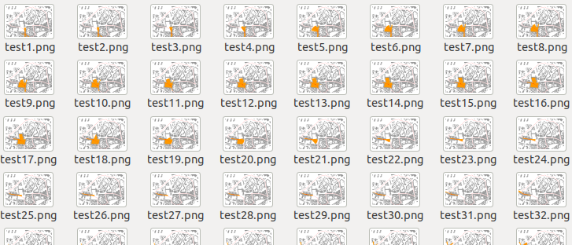

To convert them into an animated .gif file, follow these steps:

* Launch [The Gimp](https://www.gimp.org/),
* In the `File` menu, ["Open"](https://docs.gimp.org/en/gimp-file-open.html) the first image (here `test1.png`),
* In the `File` menu, choose ["Open as layers"](https://docs.gimp.org/en/gimp-file-open-as-layer.html) and load the rest of images (here from `test2.png` to `test200.png`),

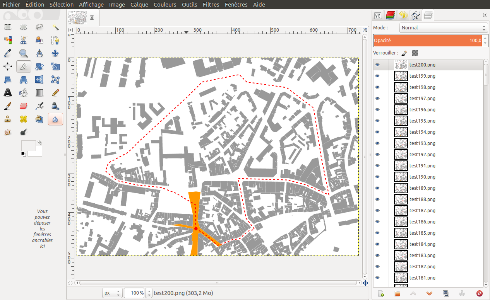

* Optionnaly, optimized the rendering for animation &rarr; `Filters` &rarr; `Animation` &rarr; `Optimize (for GIF)`,
* Export the result : `File` &rarr; `Èxport as` &rarr; choose the `.gif` file format and specify the file name and output folder &rarr; `Export`,
* In the configuration panel, choose `Save as animation` and you can specify the time between images *(by default 100ms)* &rarr; `Export`

Your animated .gif file is produced !


##### See also

* [`ST_SVF`](../ST_SVF), [`ST_GeometryShadow`](../ST_GeometryShadow)
* <a href="https://github.com/orbisgis/h2gis/blob/master/h2gis-functions/src/main/java/org/h2gis/functions/spatial/earth/ST_Isovist.java" target="_blank">Source code</a>
