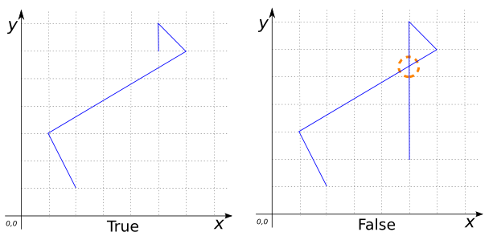

### Signature


boolean ST_IsSimple(GEOMETRY geom);


### Description

Returns true if a `GEOMETRY` is simple. A `GEOMETRY` is not simple if 
it has a self intersection, self tangency or other anomalous.



### Examples


SELECT ST_IsSimple('POLYGON((0 0, 10 0, 10 6, 0 6, 0 0), 
                            (1 1, 2 1, 2 5, 1 5, 1 1), 
                            (8 5, 8 4, 9 4, 9 5, 8 5))');
-- Answer: TRUE

SELECT ST_IsSimple('MULTILINESTRING((0 2, 3 2, 3 6, 0 6, 0 2), 
                                    (5 0, 7 0, 7 1, 5 1, 5 0))');
-- Answer: TRUE

SELECT ST_IsSimple('GEOMETRYCOLLECTION(
                      MULTIPOINT((4 4), (1 1), (1 0), (0 3)), 
                      LINESTRING(2 6, 6 2), 
                      POLYGON((1 2, 4 2, 4 6, 1 6, 1 2)))');
-- Answer: TRUE

SELECT ST_IsSimple('LINESTRING(2 1, 1 3, 6 6, 5 7, 5 6)');
-- Answer: TRUE

SELECT ST_IsSimple('LINESTRING(2 1, 1 3, 6 6, 5 7, 5 2)');
-- Answer: FALSE


##### See also

* <a href="https://github.com/irstv/H2GIS/blob/master/h2spatial/src/main/java/org/h2gis/h2spatial/internal/function/spatial/properties/ST_IsSimple.java" target="_blank">Source code</a>
