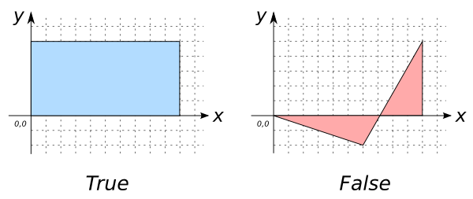

### Signature


boolean ST_IsValid(GEOMETRY geom);


### Description

Returns true if `geom` is valid.

### Examples


SELECT ST_IsValid('POLYGON((0 0, 10 0, 10 5, 0 5, 0 0))');
-- Answer:    true

SELECT ST_IsValid('POLYGON ((0 0, 10 0, 10 5, 6 -2, 0 0))');
-- Answer:    false


##### See also

* <a href="https://github.com/irstv/H2GIS/blob/master/h2spatial-ext/src/main/java/org/h2gis/h2spatialext/function/spatial/predicates/ST_IsValid.java" target="_blank">Source code</a>
* Added: <a href="https://github.com/irstv/H2GIS/pull/26" target="_blank">#26</a>
