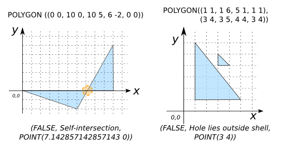

### Signatures


Object[] ST_IsValidDetail(GEOMETRY geom);
Object[] ST_IsValidDetail(GEOMETRY geom, INT flag);


### Description
Returns a valid detail (isvalid, reason, errorLocation) as an array of objects.

The value for `flag` can be:
* 0 = It will based on the OGC geometry model(Default value),
* 1 = It will validate inverted shells and exverted holes according the ESRI SDE model. 

### Examples


SELECT ST_IsvalidDetail('POLYGON((210 440, 134 235, 145 233, 
                                  310 200, 340 360, 210 440))');
-- Answer: (TRUE, Valid Geometry, null)

SELECT ST_IsvalidDetail('POLYGON((0 0 1, 10 0 1, 10 5 1, 6 -2 1, 
                                  0 0 1))');
-- Answer: (FALSE, Self-intersection, POINT(7.142857142857143 0 1))

SELECT ST_IsvalidDetail('POLYGON((1 1, 1 6, 5 1, 1 1), 
                                 (3 4, 3 5, 4 4, 3 4))', 0);
-- Answer: (FALSE, Hole lies outside shell, POINT(3 4))



SELECT ST_IsValidDetail('POLYGON((3 0, 0 3, 6 3, 3 0, 4 2, 2 2,
                                  3 0))',0);
-- Answer: (FALSE, Ring Self-intersection, POINT(3 0))

SELECT ST_IsValidDetail('POLYGON((3 0, 0 3, 6 3, 3 0, 4 2, 2 2,
                                  3 0))',1);
-- Answer: (TRUE, Valid Geometry, null)


##### See also

* [`ST_IsValid`](../ST_IsValid), [`ST_IsValidReason`](../ST_IsValidReason)
* <a href="https://github.com/irstv/H2GIS/blob/847a47a2bd304a556434b89c2d31ab3ba547bcd0/h2spatial-ext/src/main/java/org/h2gis/h2spatialext/function/spatial/properties/ST_IsValidDetail.java" target="_blank">Source code</a>
