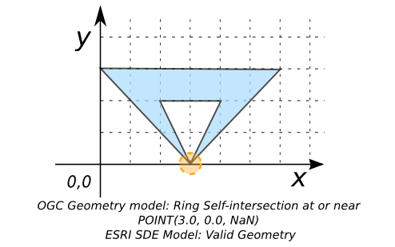

### Signatures


varchar ST_IsValidReason(GEOMETRY geom);
varchar ST_IsValidReason(GEOMETRY geom, int flag);


### Description
Returns text stating if a geometry is valid or not and if not valid, a reason why. 
The value for `flag` can be:
* 0 = It will based on the OGC geometry model(Default value),
* 1 = It will validate inverted shells and exverted holes according the ESRI SDE model. 

### Examples


SELECT ST_IsvalidDetail('POLYGON((210 440, 134 235, 145 233, 
                                  310 200, 340 360, 210 440))');
-- Answer: Valid Geometry

SELECT ST_IsvalidDetail('POLYGON((0 0, 10 0, 10 5, 6 -2, 0 0))');
-- Answer: Self-intersection at or near 
--     POINT(7.142857142857143, 0.0, NaN)

SELECT ST_IsvalidDetail('POLYGON((1 1, 1 6, 5 1, 1 1), 
                                 (3 4, 3 5, 4 4, 3 4))', 0);
-- Answer: Hole lies outside shell at or near POINT(3.0, 4.0, NaN)



SELECT ST_IsValidDetail('POLYGON((3 0, 0 3, 6 3, 3 0, 4 2, 2 2,
                                  3 0))',0);
-- Answer: Ring Self-intersection at or near POINT(3.0, 0.0, NaN)

SELECT ST_IsValidDetail('POLYGON((3 0, 0 3, 6 3, 3 0, 4 2, 2 2,
                                  3 0))',1);
-- Answer: Valid Geometry


##### See also

* [`ST_IsValid`](../ST_IsValid), [`ST_IsValidDetail`](../ST_IsValidDetail)
* <a href="https://github.com/irstv/H2GIS/blob/847a47a2bd304a556434b89c2d31ab3ba547bcd0/h2spatial-ext/src/main/java/org/h2gis/h2spatialext/function/spatial/properties/ST_IsValidReason.java" target="_blank">Source code</a>

