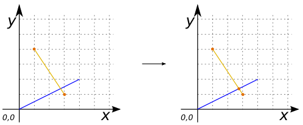
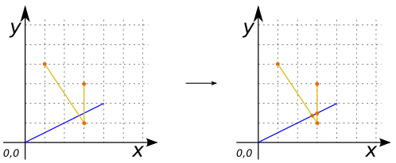
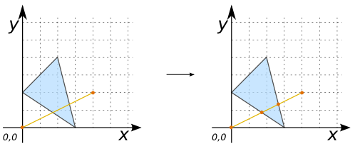

### Signatures


GEOMETRY ST_LineIntersector(GEOMETRY geomA, GEOMETRY geomB);


### Description

LineIntersector is used to split an input `geometry` (`LINESTRING` or `MULTILINESTRING`) (`geomA`) with a set of geometries (`geomB`).

As a result, a collection of `LINESTRING` is returned.

### Examples


SELECT ST_LineIntersector('LINESTRING(1 3, 3 1)',
                          'LINESTRING(0 0, 4 2)') as GEOM;
-- Answer: MULTILINESTRING ((1 3, 2.66 1.33), (2.66 1.33, 3 1)) 



SELECT ST_LineIntersector('LINESTRING(1 3, 3 1, 3 3)',
                          'LINESTRING(0 0, 4 2)') as GEOM;
-- Answer: MULTILINESTRING ((1 3, 2.66 1.33), (2.66 1.33, 3 1, 3 1.5), (3 1.5, 3 3)) 



SELECT ST_LineIntersector('LINESTRING(0 0, 4 2)', 
                          'POLYGON ((2 4, 0 2, 3 0, 2 4))') as GEOM;
-- Answer: MULTILINESTRING ((0 0, 1.71 0.85), (1.71 0.85, 2.66 1.33), (2.66 1.33, 4 2)) 


##### See also

* [`ST_Split`](../ST_Split), [`ST_Intersection`](../ST_Intersection)
* <a href="https://github.com/orbisgis/h2gis/blob/master/h2gis-functions/src/main/java/org/h2gis/functions/spatial/split/ST_LineIntersector.java" target="_blank">Source code</a>
