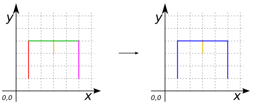

### Signatures


MULTILINESTRING ST_LineMerge(GEOMETRY geom);


### Description

Merges a collection of `LINESTRING` elements in order to create a new collection of maximal-length `LINESTRING`s. 

If the user provide something else than `(MULTI)LINESTRING` it returns an `EMPTY MULTILINESTRING`.

### Examples

##### Case with a `LINESTRING`


SELECT ST_LineMerge('LINESTRING (1 1, 1 4)') as GEOM;
-- Answer: MULTILINESTRING ((1 1, 1 4)) 


##### Case with a `MULTILINESTRING`


SELECT ST_LineMerge('MULTILINESTRING ((1 1, 1 4), 
  				      (1 4, 5 4), 
  				      (5 4, 5 1), 
  				      (3 3, 3 4))') as GEOM;
-- Answer: MULTILINESTRING ((1 1, 1 4, 5 4, 5 1), 
--                          (3 3, 3 4)) 


##### Case with mixed dimension geometries


SELECT ST_LineMerge('GEOMETRYCOLLECTION (
			LINESTRING (1 1, 1 4), 
			POLYGON ((2 4, 4 4, 4 2, 2 2, 2 4)))');
-- Answer: MULTILINESTRING EMPTY


##### See also

* [`ST_Simplify`](../ST_Simplify)
* <a href="https://github.com/orbisgis/h2gis/blob/master/h2gis-functions/src/main/java/org/h2gis/functions/spatial/aggregate/ST_LineMerge.java" target="_blank">Source code</a>
