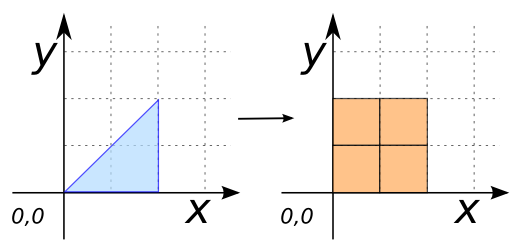
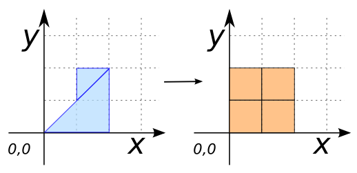

### Signature


TABLE[GEOM, ID, ID_COL, ID_ROW]
    ST_MakeGrid(GEOMETRY geom, DOUBLE deltaX, DOUBLE deltaY);
TABLE[GEOM, ID, ID_COL, ID_ROW]
    ST_MakeGrid(VARCHAR tableName, DOUBLE deltaX, DOUBLE deltaY);


### Description

Calculates a regular grid of `POLYGON`s based on a single Geometry
`geom` or a table `tableName` of Geometries with `deltaX` and
`deltaY` as offsets in the Cartesian plane.

### Examples


-- Using a Geometry:
CREATE TABLE grid AS SELECT * FROM
    ST_MakeGrid('POLYGON((0 0, 2 0, 2 2, 0 0))'::GEOMETRY, 1, 1);
SELECT * FROM grid;
-- Answer:
-- |             GEOM              |  ID | ID_COL | ID_ROW |
-- | ---------------------------------- | --- | ------ | ------ |
-- | POLYGON((0 0, 1 0, 1 1, 0 1, 0 0)) |   0 |      1 |      1 |
-- | POLYGON((1 0, 2 0, 2 1, 1 1, 1 0)) |   1 |      2 |      1 |
-- | POLYGON((0 1, 1 1, 1 2, 0 2, 0 1)) |   2 |      1 |      2 |
-- | POLYGON((1 1, 2 1, 2 2, 1 2, 1 1)) |   3 |      2 |      2 |



-- Using a table:
CREATE TABLE TEST(GEOM GEOMETRY);
INSERT INTO TEST VALUES ('POLYGON((0 0, 2 0, 2 2, 0 0))');
CREATE TABLE grid AS SELECT * FROM
    ST_MakeGrid('TEST', 1, 1);
SELECT * FROM grid;
-- Answer:
-- |             GEOM              |  ID | ID_COL | ID_ROW |
-- | ---------------------------------- | --- | ------ | ------ |
-- | POLYGON((0 0, 1 0, 1 1, 0 1, 0 0)) |   0 |      1 |      1 |
-- | POLYGON((1 0, 2 0, 2 1, 1 1, 1 0)) |   1 |      2 |      1 |
-- | POLYGON((0 1, 1 1, 1 2, 0 2, 0 1)) |   2 |      1 |      2 |
-- | POLYGON((1 1, 2 1, 2 2, 1 2, 1 1)) |   3 |      2 |      2 |

-- Using a subquery to construct a Geometry:
CREATE TABLE TEST2(GEOM GEOMETRY);
INSERT INTO TEST2 VALUES
    ('POLYGON((0 0, 2 0, 2 2, 0 0))'),
    ('POLYGON((1 1, 2 2, 1 2, 1 1))');
CREATE TABLE grid AS SELECT * FROM
    ST_MakeGrid((SELECT ST_Union(ST_Accum(GEOM)) FROM TEST2),
                1, 1);
SELECT * FROM grid;
-- Answer:
-- |             GEOM              |  ID | ID_COL | ID_ROW |
-- | ---------------------------------- | --- | ------ | ------ |
-- | POLYGON((0 0, 1 0, 1 1, 0 1, 0 0)) |   0 |      1 |      1 |
-- | POLYGON((1 0, 2 0, 2 1, 1 1, 1 0)) |   1 |      2 |      1 |
-- | POLYGON((0 1, 1 1, 1 2, 0 2, 0 1)) |   2 |      1 |      2 |
-- | POLYGON((1 1, 2 1, 2 2, 1 2, 1 1)) |   3 |      2 |      2 |


##### See also

* [`ST_MakeGridPoints`](../ST_MakeGridPoints)
* <a href="https://github.com/orbisgis/h2gis/blob/master/h2gis-functions/src/main/java/org/h2gis/functions/spatial/create/ST_MakeGrid.java" target="_blank">Source code</a>
