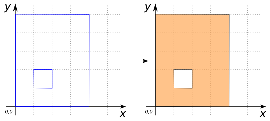

### Signatures


POLYGON ST_MakePolygon(GEOMETRY shell);
POLYGON ST_MakePolygon(GEOMETRY shell, GEOMETRY... holes)


### Description

Creates a `POLYGON` with the given `shell` and `holes`, which are
required to be closed `LINESTRING`s.

### Examples


SELECT ST_MakePolygon(
        'LINESTRING(100 250, 100 350, 200 350, 200 250, 100 250)');
-- Answer: POLYGON((100 250, 100 350, 200 350, 200 250, 100 250))

SELECT ST_MakePolygon(
            'LINESTRING(0 5, 4 5, 4 0, 0 0, 0 5)',
            'LINESTRING(1 1, 1 2, 2 2, 2 1, 1 1)');
-- Answer:     POLYGON((0 5, 4 5, 4 0, 0 0, 0 5),
--                     (1 1, 1 2, 2 2, 2 1, 1 1))


##### Non-examples


SELECT ST_MakePolygon('POINT(100 250)');
-- ERROR: Only supports LINESTRINGs.

SELECT ST_MakePolygon(
            'LINESTRING(100 250, 100 350, 200 350, 200 250)');
-- ERROR: The LINESTRING must be closed.


##### See also

* <a href="https://github.com/irstv/H2GIS/blob/master/h2spatial-ext/src/main/java/org/h2gis/h2spatialext/function/spatial/create/ST_MakePolygon.java" target="_blank">Source code</a>
