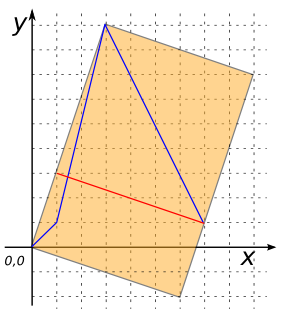
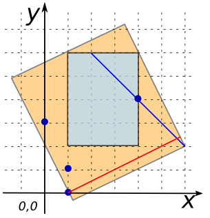

### Signature


LINESTRING ST_MinimumDiameter(GEOMETRY geom);


### Description
Returns the minimum diameter for a `geom`. 
The minimum diameter is computed from to the minimum rectangle which encloses a input
Geometry.

### Examples


SELECT ST_MinimumDiameter('POINT(395 278)');
-- Answer: LINESTRING(395 278, 395 278)

SELECT ST_MinimumDiameter('LINESTRING(0 0, 1 1, 3 9, 7 1)');
-- Answer: LINESTRING(1 3, 7 1)



SELECT ST_MinimumDiameter('POLYGON((360 380, 230 150, 370 100, 
                                    510 100, 517 110, 650 390, 
                                    430 220, 360 380))');
-- Answer: LINESTRING(282.35 242.62, 517 110)

SELECT ST_MinimumDiameter('GEOMETRYCOLLECTION(
                      POLYGON((1 2, 4 2, 4 6, 1 6, 1 2)), 
                      LINESTRING(2 6, 6 2), 
                      MULTIPOINT((4 4), (1 1), (1 0), (0 3)))');
-- Answer: LINESTRING(5.8 2.4, 1 0)


##### See also

* [`ST_MinimumRectangle`](../ST_MinimumRectangle)
* <a href="https://github.com/irstv/H2GIS/blob/a8e61ea7f1953d1bad194af926a568f7bc9aac96/h2spatial-ext/src/main/java/org/h2gis/h2spatialext/function/spatial/properties/ST_MinimumDiameter.java" target="_blank">Source code</a>

