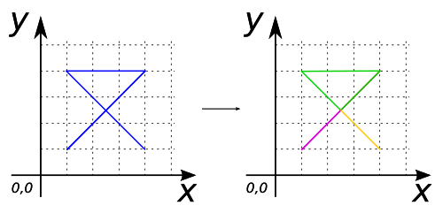
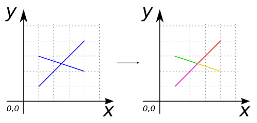
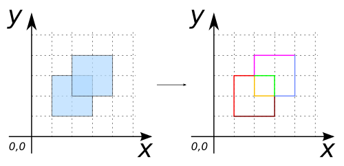
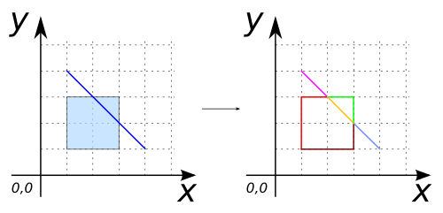

### Signature


MULTILINESTRING ST_Node(GEOMETRY geom);


### Description

Add nodes on a `geometry` for each intersections.

The resulting `geometry` is a `MultiLinestring`.

This function supports 3d coordinates and preserve `z` values **only** for input nodes. New calculated nodes have no `z` value.

### Examples

#### With 2D `Linestring`

-- Initialize the input 2D Linestring layer
CREATE TABLE line AS SELECT 
  ST_GeomFromText('LINESTRING(1 1, 4 4, 1 4, 4 1)') as geom;
-- Compute nodes
CREATE TABLE nodes AS SELECT ST_NODE(geom) FROM line;

-- Answer: MULTILINESTRING ((1 1, 2.5 2.5), 
			    (2.5 2.5, 4 4, 1 4, 2.5 2.5), 
			    (2.5 2.5, 4 1))


#### With 3D `Linestring`

-- Initialize the input 3D Linestring layer
CREATE TABLE line AS SELECT 
  ST_GeomFromText('LINESTRING(1 1 0, 4 4 3, 1 4 3, 4 1 0)') as geom;
-- Compute nodes
CREATE TABLE nodes AS SELECT ST_NODE(geom) FROM line;

-- Answer: MULTILINESTRING ((1 1 0, 2.5 2.5), 
			    (2.5 2.5, 4 4 3, 1 4 3, 2.5 2.5), 
			    (2.5 2.5, 4 1 0))


#### With `MultiLinestring`

-- Initialize the input MultiLinestring layer
CREATE TABLE lines AS SELECT 
  ST_GeomFromText('MULTILINESTRING((1 1, 4 4), (1 3, 4 2))') as geom;
-- Compute nodes
CREATE TABLE nodes AS SELECT ST_NODE(geom) FROM lines;

-- Answer: MULTILINESTRING ((1 1, 2.5 2.5), (2.5 2.5, 4 4), 
			    (1 3, 2.5 2.5), (2.5 2.5, 4 2))


#### With `MultiPolygon`

-- Initialize the input MultiPolygon layer
CREATE TABLE polygon AS SELECT 
  ST_GeomFromText('MULTIPOLYGON(((1 1, 1 3, 3 3, 3 1, 1 1)), 
				((2 4, 4 4, 4 2, 2 2, 2 4)))') as geom;
-- Compute nodes
CREATE TABLE nodes AS SELECT ST_NODE(geom) FROM polygon;

-- Answer: MULTILINESTRING ((1 1, 1 3, 2 3), (2 3, 3 3, 3 2), 
			    (3 2, 3 1, 1 1), (2 4, 4 4, 4 2, 3 2), 
			    (3 2, 2 2, 2 3), (2 3, 2 4))


#### With `GeometryCollection`

-- Initialize the input GeometryColletion layer
CREATE TABLE geomColl AS SELECT 
  ST_GeomFromText('GEOMETRYCOLLECTION(
		      POLYGON ((1 1, 1 3, 3 3, 3 1, 1 1)), 
		      LINESTRING (1 4, 4 1))') as geom;
-- Compute nodes
CREATE TABLE nodes AS SELECT ST_NODE(geom) FROM geomColl;

-- Answer: MULTILINESTRING ((1 1, 1 3, 2 3), (2 3, 3 3, 3 2), 
			    (3 2, 3 1, 1 1), (1 4, 2 3), 
			    (2 3, 3 2), (3 2, 4 1))


##### See also

* <a href="https://github.com/orbisgis/h2gis/blob/master/h2gis-functions/src/main/java/org/h2gis/functions/spatial/topology/ST_Node.java" target="_blank">Source code</a>
