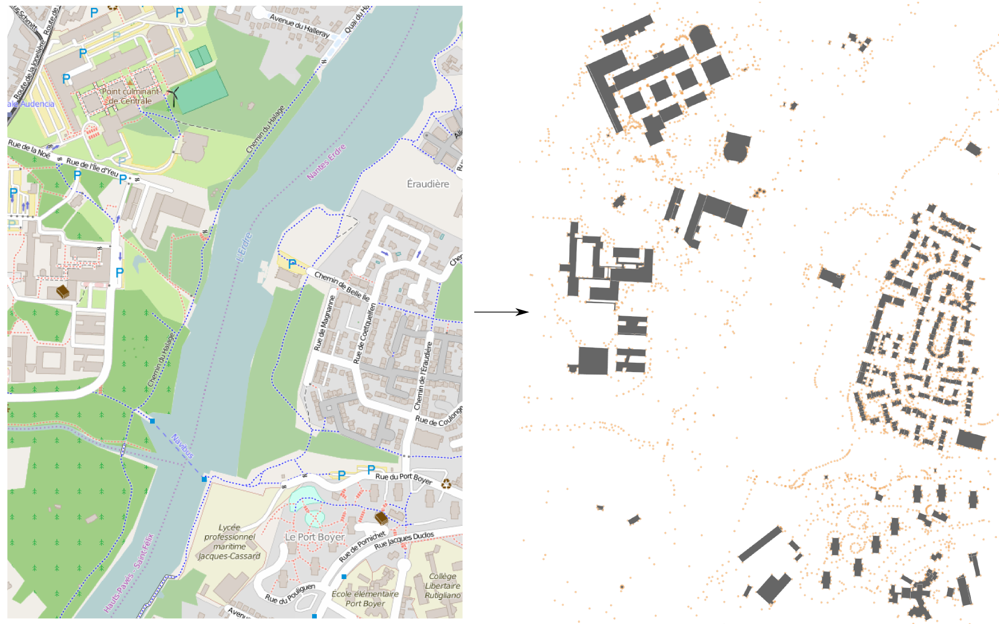

### Signatures


ST_OSMDownloader(GEOMETRY geom, VARCHAR path);
ST_OSMDownloader(GEOMETRY geom, VARCHAR path, BOOLEAN delete);


### Description

Download data from the [OSM][wiki] API using a bounding box (`geom`). The result is stored in an `.osm` file which the place and the name are defined in the `path`. If the `delete` parameter is equal to `true`, then the `.osm` file will be overwritten if it already exists.

### Examples

Download OSM data:

CALL ST_OSMDownloader('POLYGON((-1.55 47.24, -1.55 47.25, 
                                -1.54 47.25, -1.54 47.24, 
                                -1.55 47.24))'::geometry, 
                      '/your_url/test.osm');


Read OSM file:


CALL OSMRead('/your_url/test.osm');


Note that the OSMRead function is described [HERE](../OSMRead).

Result:

On the left a screenshot from the [OpenStreetMap](http://www.openstreetmap.org) website and on the right the result, with the building reconstruction (see [OSMRead](../OSMRead)).

##### See also

* [`OSMRead`](../OSMRead), [`ST_OSMMapLink`](../ST_OSMMapLink)
* <a href="https://github.com/orbisgis/h2gis/blob/master/h2gis-functions/src/main/java/org/h2gis/functions/io/osm/ST_OSMDownloader.java" target="_blank">Source code</a>

[wiki]: http://wiki.openstreetmap.org/wiki/OSM_XML

