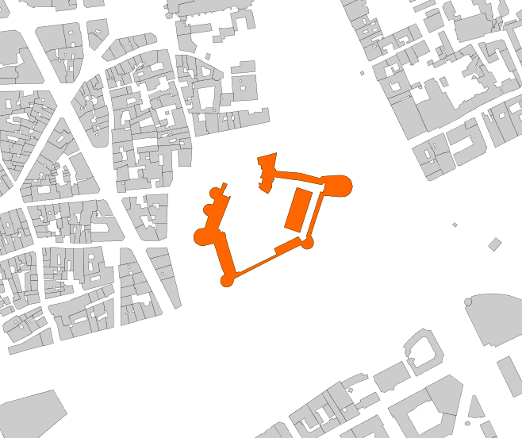
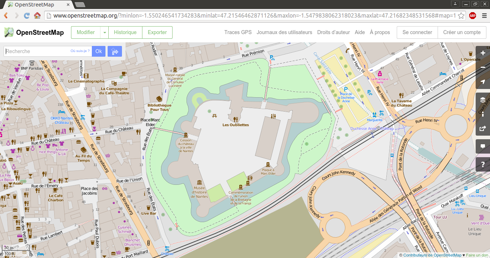
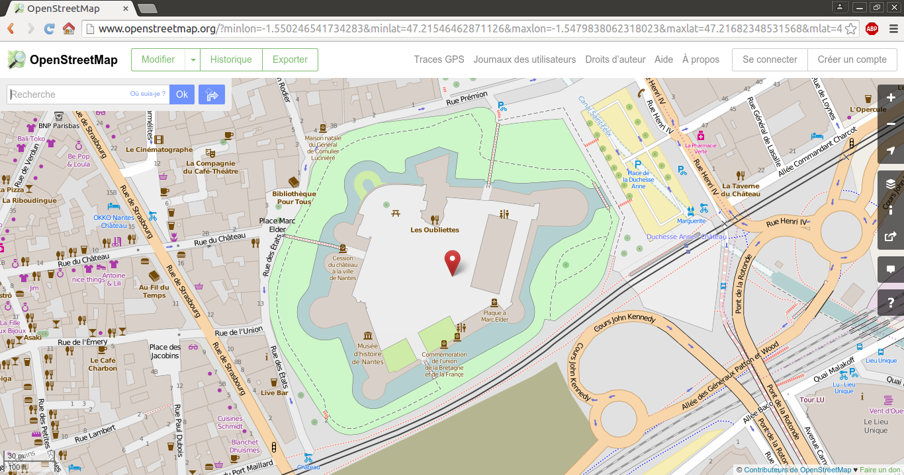

### Signature


VARCHAR ST_OSMMapLink(GEOMETRY geom);
VARCHAR ST_OSMMapLink(GEOMETRY geom, BOOLEAN marker);


### Description

Create an OSM map link based on the bounding box (bbox) of a `geometry`.
If `marker` is noted as `true`, then a red dot is placed on the `bbox` center.

### Remark
The `geometry` must be exprimed in WGS84 (EPSG:4326). 

To transform from your projection system to WGS84, please read [`ST_SetSRID`](../ST_SetSRID) (if the current projection is not already defined) and [`ST_Transform`](../ST_Transform) functions.

### Examples

Use case with the Castle of Nantes, which coordinates are exprimed in the French projection system "Lambert 93" (EPSG:2154). The `geometry` is stored in a table called `NANTES_CASTLE`.


| the_geom MULTIPOLYGON               |
|-------------------------------------|
| MULTIPOLYGON (((355815.5 6689436.9, 355816.1 6689439.3, 355817.3 6689441.4, 355818.9 6689443.3, 355820.7 6689444.5, 355822.9 6689445.3, 355827.7 6689445.7, 355831.9 6689458.7, 355829.8 6689459.9, 355828 6689461.2, 355826.6 6689463.5, 355826.2 6689466.1, 355826.7 6689468.2, 355827.5 6689469.6, 355829.1 6689471.1, 355831.5 6689472.1, 355834.3 6689472.1, 355836.5 6689471.4, 355838.9 6689477.4, 355838 6689477.6, 355835.9 6689478.6, 355834.3 6689480.2, 355833.8 6689481.2, 355833.2 6689482.7, 355833.1 6689484.8, 355833.7 6689486.9, 355835 6689488.6, 355837 6689490, 355839.7 6689490.5, 355841.8 6689490.2, 355843.2 6689489.4, 355845.4 6689488.6, 355848.2 6689495.7, 355852.5 6689494.1, 355850 6689488.2, 355849.5 6689488.3, 355849 6689487, 355847.1 6689482.3, 355854.6 6689479.4, 355855.3 6689480.9, 355856.3 6689480.5, 355842.3 6689445.5, 355844.6 6689443.6, 355845.2 6689441.2, 355846.1 6689440.9, 355847.2 6689441.2, 355847 6689441.8, 355847.6 6689442, 355847.8 6689441.2, 355849.5 6689440.5, 355850.2 6689440.7, 355850.5 6689440.1, 355850.1 6689440.1, 355850.7 6689437.6, 355851.1 6689437.6, 355851.1 6689437.1, 355850.4 6689437, 355859 6689407.7, 355862.3 6689396.8, 355866 6689397.7, 355866.4 6689396.9, 355907 6689416.9, 355904.2 6689423.3, 355930.6 6689436.3, 355935 6689430.8, 355940.2 6689434.5, 355940.4 6689435.3, 355939.2 6689435.8, 355955.1 6689485.7, 355958.1 6689485.1, 355958.1 6689486.5, 355958.9 6689487.5, 355960.5 6689495.3, 355957.3 6689494.8, 355956.8 6689493.3, 355931.7 6689498.4, 355926.9 6689498.8, 355903.4 6689502.1, 355904.3 6689499.5, 355901.4 6689494.7, 355901.7 6689490.7, 355897.4 6689483.6, 355889.4 6689488.1, 355889.7 6689488.6, 355888 6689490.2, 355887.5 6689490, 355887.2 6689490.6, 355887.6 6689490.7, 355888.1 6689493.3, 355887.7 6689493.5, 355887.8 6689494, 355887 6689494.3, 355887.3 6689495.3, 355889.5 6689494.8, 355890.5 6689495.3, 355891.9 6689500.4, 355889.1 6689500.9, 355889.4 6689502.6, 355889.9 6689502.5, 355891.8 6689510.4, 355889.8 6689510.6, 355889.9 6689514.8, 355886.9 6689515.7, 355885.6 6689522.9, 355907 6689528.7, 355903.8 6689511.1, 355904.9 6689511, 355906 6689510.5, 355906.1 6689509.3, 355905.9 6689508.5, 355933 6689506.3, 355954.3 6689500.6, 355957 6689502.7, 355975.4 6689503.8, 355978.9 6689503.7, 355980.8 6689503.4, 355983.6 6689502.4, 355986.1 6689500.7, 355987.5 6689499.2, 355988.6 6689497.5, 355989.7 6689494.8, 355990.2 6689491.8, 355990 6689489.8, 355989.3 6689487.2, 355988.4 6689485.4, 355987.3 6689483.9, 355984.8 6689481.7, 355982.2 6689480.4, 355977.1 6689480.1, 355958.7 6689481.6, 355944.4 6689437.9, 355947.3 6689431.9, 355947.5 6689430.7, 355947.5 6689428.2, 355946.5 6689425.8, 355945.9 6689425, 355943.8 6689423.4, 355942.3 6689422.8, 355940.5 6689422.5, 355938.6 6689422.7, 355937 6689423.4, 355935.5 6689424.4, 355934.4 6689425.8, 355933.6 6689427.4, 355910.2 6689415.8, 355908.1 6689414.7, 355860.1 6689390.1, 355859 6689386, 355858.4 6689384.6, 355857.2 6689382.9, 355856 6689382, 355854.7 6689381.3, 355851.7 6689380.7, 355848.7 6689381.5, 355847.9 6689382, 355846.2 6689383.6, 355845.5 6689385, 355845.1 6689387.1, 355845.3 6689388.9, 355845.7 6689390.4, 355846.4 6689391.9, 355847.6 6689393.2, 355849 6689394.1, 355850 6689394.5, 355846.6 6689401.7, 355846.2 6689402.6, 355838 6689429.1, 355831.5 6689427.5, 355826.7 6689426.4, 355824.2 6689426.4, 355821.7 6689426.9, 355819.5 6689428.1, 355817.8 6689429.7, 355816.5 6689431.6, 355815.7 6689433.9, 355815.5 6689436.9)), ((355932.4 6689440.8, 355915.2 6689446.6, 355929 6689490.4, 355946.4 6689484.8, 355932.4 6689440.8)))  |


##### Case without `marker`


SELECT ST_OSMMAPLINK(
      ST_TRANSFORM(ST_SETSRID(THE_GEOM, 2154), 4326)
                    ) as URL FROM NANTES_CASTLE; 


Answer: [http://www.openstreetmap.org/?minlon=-1.550246541734283&minlat=47.21546462871126&maxlon=-1.5479838062318023&maxlat=47.21682348531568](http://www.openstreetmap.org/?minlon=-1.550246541734283&minlat=47.21546462871126&maxlon=-1.5479838062318023&maxlat=47.21682348531568)

##### Case with `marker`


SELECT ST_OSMMAPLINK(
      ST_TRANSFORM(ST_SETSRID(THE_GEOM, 2154), 4326), true
                    ) as URL FROM NANTES_CASTLE;


Answer: [http://www.openstreetmap.org/?minlon=-1.550246541734283&minlat=47.21546462871126&maxlon=-1.5479838062318023&maxlat=47.21682348531568&mlat=47.216144057013466&mlon=-1.5491151739830427](http://www.openstreetmap.org/?minlon=-1.550246541734283&minlat=47.21546462871126&maxlon=-1.5479838062318023&maxlat=47.21682348531568&mlat=47.216144057013466&mlon=-1.5491151739830427) 

##### See also

* [`ST_GoogleMapLink`](../ST_GoogleMapLink), [`ST_OSMDownloader`](../ST_OSMDownloader), [`OSMRead`](../OSMRead)
* <a href="https://github.com/orbisgis/h2gis/blob/master/h2gis-functions/src/main/java/org/h2gis/functions/spatial/convert/ST_OSMMapLink.java" target="_blank">Source code</a>
