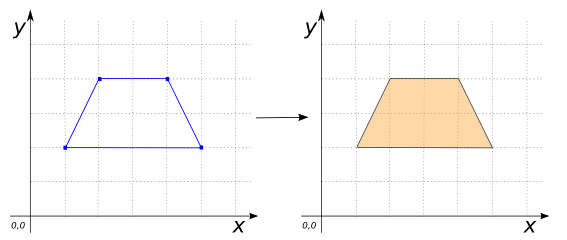
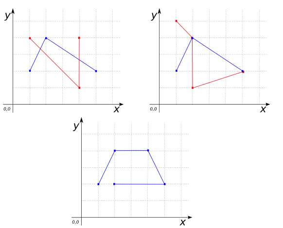

### Signature


MULTIPOLYGON ST_Polygonize(GEOMETRY geom);


### Description

Creates a `MULTIPOLYGON` containing all possible `POLYGON`s formed
from `geom`.

    <h5> Returns <code>NULL</code> if the endpoints of
    <code>geom</code> are not properly joined or <code>geom</code>
    cannot be "polygonized" (e.g., <code>POINT</code>s).</h5>

### Examples


SELECT ST_Polygonize('LINESTRING(1 2, 2 4, 4 4, 5 2, 1 2)');
-- Answer: MULTIPOLYGON(((1 2, 2 4, 4 4, 5 2, 1 2)))



SELECT ST_Polygonize('MULTILINESTRING((1 2, 2 4, 5 2),
                                      (5 2, 2 1, 1 2))');
-- Answer: MULTIPOLYGON(((1 2, 2 4, 5 2, 2 1, 1 2)))



-- ST_Polygonize of a POLYGON is the same POLYGON converted to a
-- MULTIPOLYGON:
SELECT ST_Polygonize('POLYGON((2 2, 2 4, 5 4, 5 2, 2 2))');
-- Answer: MULTIPOLYGON((2 2, 2 4, 5 4, 5 2, 2 2))

-- This example shows that ST_Polygonize is "greedy" in the sense
-- that it will construct as many POLYGONs as possible. Here it
-- finds only one:
SELECT ST_Polygonize(ST_Union('MULTILINESTRING((1 2, 2 4, 5 2),
                                               (1 4, 4 1, 4 4))'));
-- Answer: MULTIPOLYGON(((1.6666666666666667 3.3333333333333335,
--                        2 4, 4 2.6666666666666665, 4 1,
--                        1.6666666666666667 3.3333333333333335)))



-- Here we do the same example as before but close the LINESTRINGs,
-- so that three polygons are produced:
SELECT ST_Polygonize(
            ST_Union('MULTILINESTRING((1 2, 2 4, 5 2),
                                      (1 2, 1 4, 4 1, 4 4, 5 2))'));
Answer: MULTIPOLYGON (((4 2.6666666666666665, 4 1,
                        1.6666666666666667 3.3333333333333335,
                        2 4, 4 2.6666666666666665)),
                      ((1.6666666666666667 3.3333333333333335,
                        1 2, 1 4,
                        1.6666666666666667 3.3333333333333335)),
                      ((4 2.6666666666666665,
                        4 4, 5 2,
                        4 2.6666666666666665)))


##### Non-examples


-- Returns NULL for Geometries which cannot be "polygonized":
SELECT ST_Polygonize('POINT(1 2)');
-- Answer: NULL

-- In the following three examples, the endpoints are not properly
-- joined:
SELECT ST_Polygonize('MULTILINESTRING((1 2, 2 4, 5 2),
                                      (1 4, 4 1, 4 4))')
-- Answer: NULL

SELECT ST_Polygonize('MULTILINESTRING((1 2, 2 4, 4 4, 5 2),
                                      (5 2, 2 1, 2 4, 1 5))');
-- Answer: NULL

SELECT ST_Polygonize('LINESTRING(1 2, 2 4, 4 4, 5 2, 2 2)');
-- Answer: NULL


##### See also

* <a href="https://github.com/irstv/H2GIS/blob/master/h2spatial-ext/src/main/java/org/h2gis/h2spatialext/function/spatial/processing/ST_Polygonize.java" target="_blank">Source code</a>
* JTS [Polygonizer#getPolygons][jts]
* Added: <a href="https://github.com/irstv/H2GIS/pull/80" target="_blank">#80</a>

[jts]: http://tsusiatsoftware.net/jts/javadoc/com/vividsolutions/jts/operation/polygonize/Polygonizer.html#getPolygons()
