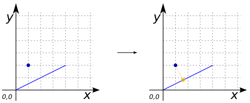
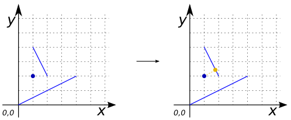
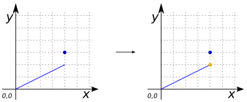
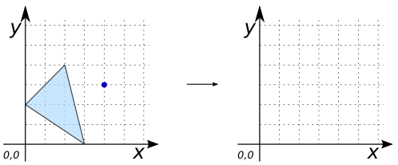

### Signatures


GEOMETRY ST_ProjectPoint(GEOMETRY geomA, GEOMETRY geomB);


### Description

Project a `POINT` (`geomA`) along a `LINESTRING` (`geomB`). If the `POINT` projected is out of the `LINESTRING` the first (or last) `POINT` on the `LINESTRING` will be returned, otherwise the input `POINT`.

### Examples


SELECT ST_PROJECTPOINT('POINT(1 2)',
                       'LINESTRING(0 0, 4 2)') as GEOM;
-- Answer: POINT (1.6 0.8)



SELECT ST_PROJECTPOINT('POINT(1 2)',
                       'MULTILINESTRING ((0 0, 4 2), (1 4, 2 2))') as GEOM;
-- Answer: POINT (1.8 2.4)



SELECT ST_PROJECTPOINT('POINT(4 3)',
                       'LINESTRING (0 0, 4 2)') as GEOM;
-- Answer: POINT (4 2)



SELECT ST_PROJECTPOINT('POINT(4 3)',
                       'POLYGON ((2 4, 0 2, 3 0, 2 4))') as GEOM;
-- Answer: NULL


##### See also

* [`ST_ShortestLine`](../ST_ShortestLine), [`ST_LocateAlong`](../ST_LocateAlong), [`ST_ClosestPoint`](../ST_ClosestPoint)
* <a href="https://github.com/orbisgis/h2gis/blob/master/h2gis-functions/src/main/java/org/h2gis/functions/spatial/distance/ST_ProjectPoint.java" target="_blank">Source code</a>
