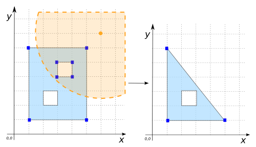

### Signatures


GEOMETRY ST_RemovePoint(GEOMETRY geom, POINT point);
GEOMETRY ST_RemovePoint(GEOMETRY geom, POINT point, 
                        double tolerance);


### Description
Remove all vertices that are located within an envelope based on `tolerance`.
The `tolerance` can be set to define a buffer area. 
If the `tolerance` is no precised the value by default is 10E-6 buffer distance.



### Examples


SELECT ST_RemovePoint('POINT(1 1)', 'POINT(1 1)', 10);
-- Answer: currently POINT(1 1)
-- in future: POINT EMPTY

SELECT ST_RemovePoint('MULTIPOINT((5 5), (10 10))', 
                      'POINT(10 10)');
-- Answer: MULTIPOINT((5 5))

SELECT ST_RemovePoint('MULTIPOINT((5 5), (10 10), 
                                  (100 1000))', 
                      'POINT(10 10)', 10);
-- Answer: MULTIPOINT((100 1000))

SELECT ST_RemovePoint('MULTIPOINT((5 5), (3 1))', 
                      'POINT(4 2)',1);
-- Answer: MULTIPOINT((5 5))



SELECT ST_RemovePoint('POLYGON((150 250, 220 250, 220 170, 
                                1 50, 150 250))', 
                      'POINT(230 250)', 10);
-- Answer: POLYGON((150 250, 220 170, 150 170, 150 250))


#####POLYGON with holes


SELECT ST_RemovePoint('POLYGON((1 1, 1 6, 5 6, 5 1, 1 1), 
  (2 2, 2 4, 4 4, 4 2, 2 2))', 'POINT(3 7)', 5);
  -- Answer: POLYGON ((1 1, 1 6, 5 6, 5 1, 1 1))

SELECT ST_RemovePoint('POLYGON((1 1, 1 6, 5 6, 5 1, 1 1), 
                                (2 2, 2 5, 4 5, 4 2, 2 2))', 
                      'POINT(4 7)', 2);
-- Answer: POLYGON((1 1, 1 6, 5 1, 1 1), (2 2, 2 5, 4 5, 4 2, 
                                          2 2))
-- POLYGON is not valid

SELECT ST_RemovePoint('POLYGON((1 1, 1 6, 5 6, 5 1, 1 1), 
                                (3 4, 3 5, 4 5, 4 4, 3 4))', 
                      'POINT(5 7)', 2);
-- Answer: POLYGON((1 1, 1 6, 5 1, 1 1), (3 4, 3 5, 4 5, 4 4, 
                                          3 4))
-- POLYGON is not valid

SELECT ST_RemovePoint('POLYGON((1 1, 1 6, 5 6, 5 1, 1 1), 
                                (3 4, 3 5, 4 5, 4 4, 3 4))', 
                      'POINT(5 7)', 3);
-- Answer: POLYGON((1 1, 1 6, 5 6, 5 1, 1 1))


|geomA LINESTRING | geomB POINT|
|--|--|
| LINESTRING(0 3, 1 1, 3 3, 5 2, 5 4, 6 5, 7 6, 7 7, 6 8) | POINT(3 4) |


SELECT ST_RemovePoint(geomA, geomB, 1);
-- Answer: LINESTRING(0 3, 1 1, 5 2, 5 4, 6 5, 7 6, 7 7, 6 8)

SELECT ST_RemovePoint(geomA, geomB, 2);
-- Answer: LINESTRING(0 3, 1 1, 6 5, 7 6, 7 7, 6 8)

SELECT ST_RemovePoint(geomA, geomB, 3);
-- Answer: LINESTRING(7 6, 7 7, 6 8)

SELECT ST_RemovePoint('LINESTRING(0 3, 1 1, 3 3, 5 2, 5 4, 6 5,
                                  7 6, 7 7, 6 8)', 
                      'POINT(3 4)', 6);
-- Answer: currently LINESTRING(0 3, 1 1, 3 3, 5 2, 5 4, 6 5, 
--                              7 6, 7 7, 6 8)
-- in future: LINESTRING EMPTY


##### See also

* <a href="https://github.com/irstv/H2GIS/blob/master/h2spatial-ext/src/main/java/org/h2gis/h2spatialext/function/spatial/edit/ST_RemovePoint.java" target="_blank">Source code</a>
* Added: <a href="https://github.com/irstv/H2GIS/pull/80" target="_blank">#80</a>
