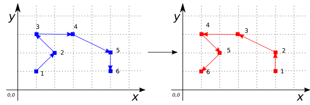

### Signature


GEOMETRY ST_Reverse(GEOMETRY geom);


### Description
Returns `geom` with vertex order reversed. The order of the components in the GEOMETRYCOLLECTION are not reversed.

### Examples


SELECT ST_Reverse('MULTIPOINT((4 4), (1 1), (1 0), (0 3))');
-- Answer: GEOMETRYCOLLECTION(POINT(4 4), POINT(1 1),
--                            POINT(1 0), POINT(0 3))

SELECT ST_Reverse('LINESTRING(1 1, 2 2, 1 3, 3 3, 5 2, 5 1)');
-- Answer: LINESTRING(5 1, 5 2, 3 3, 1 3, 2 2, 1 1)



SELECT ST_Reverse('MULTILINESTRING((10 260, 150 290, 186 406,
                                    286 286),
                                   (120 120, 130 125, 142 129,
                                    360 160, 357 170, 380 340),
                                   (1 1, 5 5))');
-- Answer: MULTILINESTRING((5 5, 1 1),
--                         (380 340, 357 170, 360 160, 142 129,
--                          130 125, 120 120),
--                         (286 286, 186 406, 150 290, 10 260))

SELECT ST_Reverse('POLYGON((2 4, 1 3, 2 1, 6 1, 6 3, 4 4, 2 4))');
-- Answer: POLYGON((2 4, 4 4, 6 3, 6 1, 2 1, 1 3, 2 4))

SELECT ST_Reverse('MULTIPOLYGON(((2 4, 1 3, 2 1, 6 1, 6 3,
                                  4 4, 2 4)),
                                ((1 6, 6 6, 6 5, 1 5, 1 6)),
                                ((0 1, 1 1, 1 0, 0 0, 0 1)))');
-- Answer: MULTIPOLYGON(((2 4, 4 4, 6 3, 6 1, 2 1, 1 3, 2 4)),
--                      ((1 6, 1 5, 6 5, 6 6, 1 6)),
--                      ((0 1, 0 0, 1 0, 1 1, 0 1)))



SELECT ST_Reverse('GEOMETRYCOLLECTION(
                      POLYGON((1 2, 4 2, 4 6, 1 6, 1 2)),
                      LINESTRING(2 6, 6 2))');
-- Answer: GEOMETRYCOLLECTION(POLYGON((1 2, 1 6, 4 6, 4 2, 1 2)),
--                            LINESTRING(6 2, 2 6))


##### See also

* [`ST_Reverse3DLine`](../ST_Reverse3DLine)
* <a href="https://github.com/irstv/H2GIS/blob/master/h2spatial-ext/src/main/java/org/h2gis/h2spatialext/function/spatial/edit/ST_Reverse.java" target="_blank">Source code</a>
* Added: <a href="https://github.com/irstv/H2GIS/pull/80" target="_blank">#80</a>
