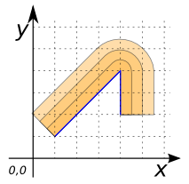
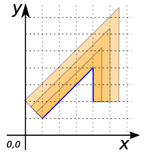
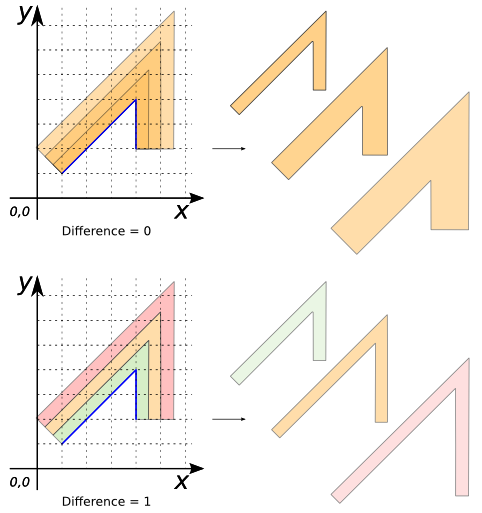

### Signature


GEOMETRY ST_RingSideBuffer(GEOMETRY geom, DOUBLE bufferSize, 
                             INT numBuffer);
GEOMETRY ST_RingSideBuffer(GEOMETRY geom, DOUBLE bufferSize, 
                             INT numBuffer, VARCHAR endCapStyle);
GEOMETRY ST_RingSideBuffer(GEOMETRY geom, DOUBLE bufferSize, 
                             INT numBuffer, VARCHAR endCapStyle, 
                             BOOLEAN doDifference);


### Description
Return a ring buffer at a given distance on only one side of each input lines of the `geom`.

The buffer size (`bufferSize`) is given in projection units.
The number of rings is defined with `numBuffer`.

The optional fourth parameter can either specify the number of segments used to
approximate a quarter circle or a `VARCHAR` list of
space-separated `key=value` pairs:

| `key=value` | Description | Default value |
|-|-|-|
| `quad_segs=#` | number of segments used to approximate a quarter circle | 8 |
| `join=round|mitre|bevel` | join style | `round` |
| `mitre_limit=#.#` | mitre ratio limit (only affects mitered join style) | 5 |

The end cap style for single-sided buffers is always ignored, and forced to the equivalent of 'flat' (Synonym of 'butt').

The `doDifference` parameter is used to define if the user want to keep only difference between buffers. Default is true (`doDifference`=1).



### Examples


SELECT ST_RINGSIDEBUFFER('LINESTRING (1 1, 4 4, 4 2)', 0.5, 3) as GEOM;
-- Answer: MULTIPOLYGON (((4 2, 4 4, 1 1, 0.6464466094067263 1.3535533905932737, 3.646446609406726 4.353553390593274, 3.722214883490199 4.4157348061512725, 3.808658283817455 4.461939766255643, 3.902454838991936 4.490392640201615, 4 4.5, 4.097545161008064 4.490392640201615, 4.191341716182545 4.461939766255643, 4.2777851165098015 4.4157348061512725, 4.353553390593274 4.353553390593274, 4.4157348061512725 4.277785116509801, 4.461939766255643 4.191341716182545, 4.490392640201615 4.097545161008064, 4.5 4, 4.5 2, 4 2)), ((1 1, 0.2928932188134524 1.7071067811865475, 3.2928932188134525 4.707106781186548, 3.444429766980398 4.831469612302545, 3.6173165676349104 4.923879532511287, 3.804909677983872 4.98078528040323, 4 5, 4.195090322016128 4.98078528040323, 4.38268343236509 4.923879532511287, 4.555570233019602 4.831469612302545, 4.707106781186548 4.707106781186548, 4.831469612302545 4.555570233019602, 4.923879532511287 4.38268343236509, 4.98078528040323 4.195090322016129, 5 4, 5 2, 4.5 2, 4.5 4, 4.490392640201615 4.097545161008064, 4.461939766255643 4.191341716182545, 4.4157348061512725 4.277785116509801, 4.353553390593274 4.353553390593274, 4.2777851165098015 4.4157348061512725, 4.191341716182545 4.461939766255643, 4.097545161008064 4.490392640201615, 4 4.5, 3.902454838991936 4.490392640201615, 3.808658283817455 4.461939766255643, 3.722214883490199 4.4157348061512725, 3.646446609406726 4.353553390593274, 0.6464466094067263 1.3535533905932737, 1 1)), ((0.2928932188134525 1.7071067811865475, -0.0606601717798214 2.0606601717798214, 2.9393398282201786 5.060660171779821, 3.1666446504705963 5.247204418453817, 3.4259748514523647 5.38581929876693, 3.707364516975807 5.471177920604846, 3.9999999999999996 5.5, 4.292635483024192 5.471177920604846, 4.574025148547634 5.38581929876693, 4.833355349529403 5.247204418453818, 5.060660171779821 5.060660171779821, 5.247204418453817 4.833355349529404, 5.38581929876693 4.574025148547635, 5.471177920604846 4.292635483024193, 5.5 4, 5.5 2, 5 2, 5 4, 4.98078528040323 4.195090322016129, 4.923879532511287 4.38268343236509, 4.831469612302545 4.555570233019602, 4.707106781186548 4.707106781186548, 4.555570233019602 4.831469612302545, 4.38268343236509 4.923879532511287, 4.195090322016128 4.98078528040323, 4 5, 3.804909677983872 4.98078528040323, 3.6173165676349104 4.923879532511287, 3.444429766980398 4.831469612302545, 3.2928932188134525 4.707106781186548, 0.2928932188134525 1.7071067811865475))) 



SELECT ST_RINGSIDEBUFFER('LINESTRING (1 1, 4 4, 4 2)', 0.5, 3, 
                         'join=mitre') as GEOM;
-- Answer: MULTIPOLYGON (((4 2, 4 4, 1 1, 0.6464466094067263 1.3535533905932737, 4.5 5.207106781186547, 4.5 2, 4 2)), ((1 1, 0.2928932188134524 1.7071067811865475, 5 6.414213562373096, 5 2, 4.5 2, 4.5 5.207106781186547, 0.6464466094067263 1.3535533905932737, 1 1)), ((0.2928932188134525 1.7071067811865475, -0.0606601717798214 2.0606601717798214, 5.5 7.621320343559642, 5.5 2, 5 2, 5 6.414213562373096, 0.2928932188134525 1.7071067811865475))) 



SELECT ST_RINGSIDEBUFFER('LINESTRING (1 1, 4 4, 4 2)', 0.5, 3, 
                         'join=mitre',0) as GEOM;
-- Answer: MULTIPOLYGON (((4 2, 4 4, 1 1, 0.6464466094067263 1.3535533905932737, 4.5 5.207106781186547, 4.5 2, 4 2)), ((4 2, 4 4, 1 1, 0.2928932188134524 1.7071067811865475, 5 6.414213562373096, 5 2, 4 2)), ((4 2, 4 4, 1 1, -0.0606601717798214 2.0606601717798214, 5.5 7.621320343559642, 5.5 2, 4 2)))

SELECT ST_RINGSIDEBUFFER('LINESTRING (1 1, 4 4, 4 2)', 0.5, 3, 
                         'join=mitre',1) as GEOM;
-- Answer: MULTIPOLYGON (((4 2, 4 4, 1 1, 0.6464466094067263 1.3535533905932737, 4.5 5.207106781186547, 4.5 2, 4 2)), ((1 1, 0.2928932188134524 1.7071067811865475, 5 6.414213562373096, 5 2, 4.5 2, 4.5 5.207106781186547, 0.6464466094067263 1.3535533905932737, 1 1)), ((0.2928932188134525 1.7071067811865475, -0.0606601717798214 2.0606601717798214, 5.5 7.621320343559642, 5.5 2, 5 2, 5 6.414213562373096, 0.2928932188134525 1.7071067811865475)))


##### See also
* [`ST_RingBuffer`](../ST_RingBuffer),
  [`ST_SideBuffer`](../ST_SideBuffer),
  [`ST_Buffer`](../ST_Buffer),
  [`ST_MakeEllipse`](../ST_MakeEllipse)
* <a href="https://github.com/orbisgis/h2gis/blob/master/h2gis-functions/src/main/java/org/h2gis/functions/spatial/buffer/ST_RingSideBuffer.java" target="_blank">Source code</a>
