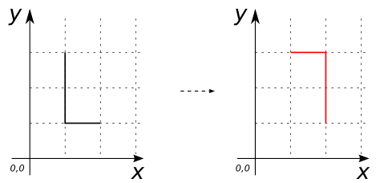

### Signatures


GEOMETRY ST_Rotate(GEOMETRY geom, double angle);
GEOMETRY ST_Rotate(GEOMETRY geom, double angle, POINT origin);
GEOMETRY ST_Rotate(GEOMETRY geom, double angle, double x, double y);


### Description

Rotates `geom` counter-clockwise by `angle` (in radians) about the point
`origin` (or about the point specified by coordinates `x` and `y`).  If no
point is specified, the geometry is rotated about its center (the center of its
internal envelope).

### Examples


SELECT ST_Rotate('LINESTRING(1 3, 1 1, 2 1)'::Geometry, pi());
-- Answer:    LINESTRING(2 1, 2 3, 1 3)



SELECT ST_Rotate('LINESTRING(1 3, 1 1, 2 1)'::Geometry, pi() / 3);
-- Answer: LINESTRING(0.3839745962155607 2.0669872981077813,
--                    2.1160254037844384 1.0669872981077806,
--                    2.6160254037844384 1.933012701892219)

SELECT ST_Rotate('LINESTRING(1 3, 1 1, 2 1)'::Geometry, -pi()/2, ST_GeomFromText('POINT(2 1)'));
-- Answer:    LINESTRING(4 1, 2 2, 2 1)

SELECT ST_Rotate('LINESTRING(1 3, 1 1, 2 1)'::Geometry, pi()/2, 1.0, 1.0);
-- Answer:    LINESTRING(-1 1, 1 1, 1 2)


##### See also

* <a href="https://github.com/irstv/H2GIS/blob/master/h2spatial-ext/src/main/java/org/h2gis/h2spatialext/function/spatial/affine_transformations/ST_Rotate.java" target="_blank">Source code</a>
* Added: <a href="https://github.com/irstv/H2GIS/pull/31" target="_blank">#31</a>
