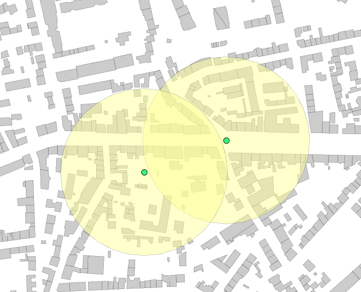
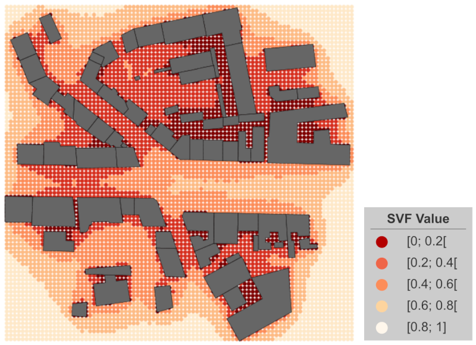

### Signature


DOUBLE ST_SVF(GEOMETRY point, GEOMETRY geoms, DOUBLE distance, 
              INTEGER rayCount)
DOUBLE ST_SVF(GEOMETRY point, GEOMETRY geoms, DOUBLE distance, 
              INTEGER rayCount, INTEGER stepRayLength)


### Description

Compute the Sky View Factor for a given point based on geometries where:

* `point` : Point coordinates (x, y, z) from which the SVF will be calculated,
* `geoms` : Geometry or set of geometries grouped into a simple or complex geometry, used as sky obstacles *(z coordinates should be given and not NaN)*,
* `distance` : Only obstacles located within this distance from the `point` are considered in the calculation *(exprimed in meters)*,
* `rayCount` : Number of ray considered for the calculation *(number of direction of calculation)*,
* `stepRayLength` : Length of sub ray used to limit the number of geometries when requested. Each ray is subdivided to make the calculation faster. This argument set the length of each subdivision. Default value = 10.

### Examples

#### Case with one entry point

Creation of the table with one point (here exprimed in Lambert 93, French system - EPSG:2154)


DROP TABLE IF EXISTS POINT;
CREATE TABLE POINT AS SELECT ('POINT(222821.90377044567 6757577.12494107)'::GEOMETRY) as geom;


Computation of the SVF with:

* BUILDING : table with buildings used as obstacles
* Distance fixed to 100m
* Number of rays fixed to 150


DROP TABLE IF EXISTS SVF;
CREATE TABLE SVF AS 
   SELECT ST_SVF(a.GEOM, ST_ACCUM(b.GEOM), 100, 150) AS SVF 
   FROM POINT a, BUILDING b;

-- Answer: 
|        SVF         |
|--------------------|
| 0.5658633540674807 |


#### Case with two entry points


-- Add a second point to compute the SVF
INSERT INTO POINT VALUES ('POINT(222723.6455 6757539.0997)'::GEOMETRY);

-- Compute the SVF for both points
DROP TABLE IF EXISTS SVF;
CREATE TABLE SVF AS 
   SELECT ST_SVF(a.GEOM, ST_ACCUM(b.GEOM), 100, 150) AS SVF 
   FROM POINT a, BUILDING b GROUP BY a.geom;

-- Answer: 
|        SVF         |
|--------------------|
| 0.5658633540674807 |
| 0.4826031275651395 |


#### Case with a grid of entry points

In the example below, we are using a grid of points to compute SVFs. The grid is built using a table of buildings.


DROP TABLE IF EXISTS env, grid, grid_points;
-- Generate the envelope of all buildings
CREATE TABLE env AS 
   SELECT ST_Envelope(ST_Accum(GEOM)) AS GEOM FROM BUILDINGS;
-- Generate a regular grid of 2 meters on the basis of the envelope
CREATE TABLE grid AS 
   SELECT * FROM ST_MakeGrid('env', 2, 2);
-- Retrieve the centroid points of all grid cells
CREATE TABLE grid_points AS 
   SELECT ST_Centroid(GEOM) AS GEOM FROM grid;
-- Add a serial column in order to have a point id
ALTER TABLE GRID_POINTS ADD COLUMN id bigint auto_increment;

-- Compute the SVF on all these points (keeping id and geometry)
-- Using all buildings that are within 50m around a point
DROP TABLE IF EXISTS SVF;
CREATE TABLE SVF AS SELECT a.GEOM, a.ID, 
   ST_SVF(a.GEOM, ST_ACCUM(b.GEOM), 50, 100) AS SVF 
   FROM GRID_POINTS a, BUILDINGS b GROUP BY a.GEOM;

-- Answer: Table "SVF"
|    GEOM    | ID |        SVF         |
|------------|----|--------------------|
| POINT(...) | 1  | 0.5658633540674807 |
| POINT(...) | 2  | 0.4826031275651395 |
| POINT(...) | 4  | 0.9134765374639576 |
| POINT(...) | 5  | 0.2521816420649933 |
...
| POINT(...) | n  | 0.4547755583760515 |



##### See also

* [`ST_SunPosition`](../ST_SunPosition), [`ST_ISOVist`](../ST_ISOVist)
* <a href="https://github.com/orbisgis/h2gis/blob/master/h2gis-functions/src/main/java/org/h2gis/functions/spatial/earth/ST_Svf.java" target="_blank">Source code</a>
