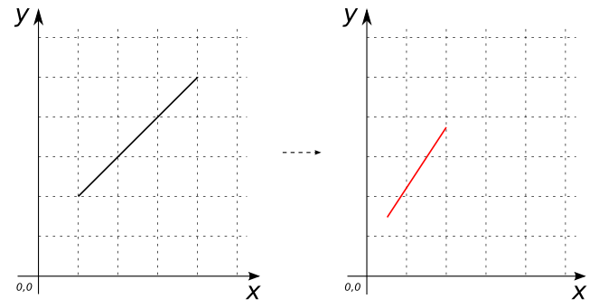

### Signatures


GEOMETRY ST_Scale(GEOMETRY geom, double xFactor, double yFactor);
GEOMETRY ST_Scale(GEOMETRY geom, double xFactor, double yFactor, double zFactor);


### Description

Scales `geom` Geometry by multiplying the ordinates by the indicated scale
factors. If `zFactor` is omitted and `geom` contains a z-coordinate, it
is left untouched.

### Examples


SELECT ST_Scale('LINESTRING(1 2, 4 5)'::Geometry, 0.5, 0.75);
-- Answer:    LINESTRING(0.5 1.5, 2 3.75)



SELECT ST_Scale('LINESTRING(1 2, 4 5)'::Geometry, 0.5, 0.75, 1.2);
-- Answer:    LINESTRING(0.5 1.5, 2 3.75)

SELECT ST_Scale('LINESTRING(1 2, 4 5)'::Geometry, 0.0, -1.0, 2.0);
-- Answer:    LINESTRING(0 -2, 0 -5)

SELECT ST_Scale('LINESTRING(1 2 3, 4 5 6)'::Geometry, 0.5, 0.75);
-- Answer:    LINESTRING(0.5 1.5 3, 2 3.75 6)

SELECT ST_Scale('LINESTRING(1 2 3, 4 5 6)'::Geometry, 0.5, 0.75, 1.2);
-- Answer:    LINESTRING(0.5 1.5 3.6, 2 3.75 7.2)

SELECT ST_Scale('LINESTRING(1 2 3, 4 5 6)'::Geometry, 0.0, -1.0, 2.0);
-- Answer:    LINESTRING(0 -2 6, 0 -5 12)


##### See also

* <a href="https://github.com/irstv/H2GIS/blob/master/h2spatial-ext/src/main/java/org/h2gis/h2spatialext/function/spatial/affine_transformations/ST_Scale.java" target="_blank">Source code</a>
* Added: <a href="https://github.com/irstv/H2GIS/pull/31" target="_blank">#31</a>
