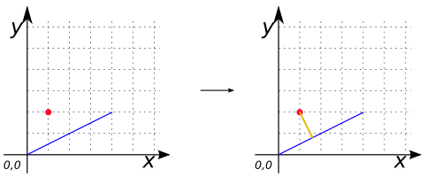
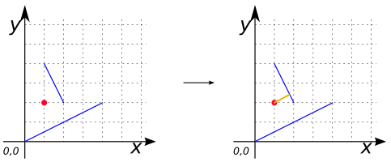
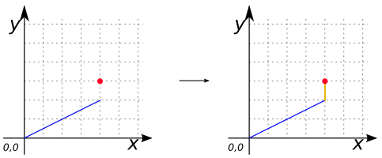
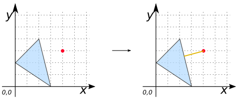
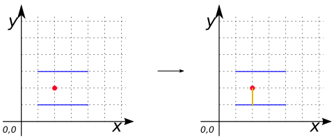

### Signatures


GEOMETRY ST_ShortestLine(GEOMETRY geomA, GEOMETRY geomB);


### Description

Returns the 2-dimensional shortest `LINESTRING` between two geometries (`geomA` and `geomB`).

The function will only return the first shortest `LINESTRING` if more than one, that the function finds.

### Examples

#### Cases with one solution


SELECT ST_ShortestLine('POINT(1 2)',
                       'LINESTRING(0 0, 4 2)') as GEOM;
-- Answer: LINESTRING (1 2, 1.6 0.8)



SELECT ST_ShortestLine('POINT(1 2)',
                       'MULTILINESTRING ((0 0, 4 2), (1 4, 2 2))') as GEOM;
-- Answer: LINESTRING (1 2, 1.8 2.4) 



SELECT ST_ShortestLine('POINT(4 3)',
                       'LINESTRING(0 0, 4 2)') as GEOM;
-- Answer: LINESTRING (4 3, 4 2)  



SELECT ST_ShortestLine('POINT(4 3)',
                       'POLYGON ((2 4, 0 2, 3 0, 2 4))') as GEOM;
-- Answer: LINESTRING (4 3, 2.353 2.5882)   


#### Case with two possible solutions


SELECT ST_ShortestLine('POINT(2 2)',
                       'MULTILINESTRING ((1 1, 4 1), (1 3, 4 3))') as GEOM;
-- Answer: LINESTRING (2 2, 2 1)  


##### See also

* [`ST_ProjectPoint`](../ST_ProjectPoint), [`ST_LocateAlong`](../ST_LocateAlong), [`ST_ClosestPoint`](../ST_ClosestPoint)
* <a href="https://github.com/orbisgis/h2gis/blob/master/h2gis-functions/src/main/java/org/h2gis/functions/spatial/distance/ST_ShortestLine.java" target="_blank">Source code</a>
