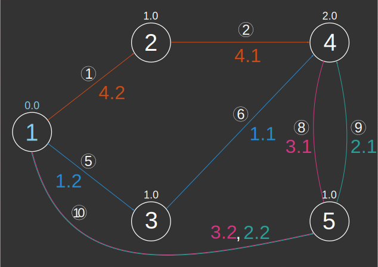
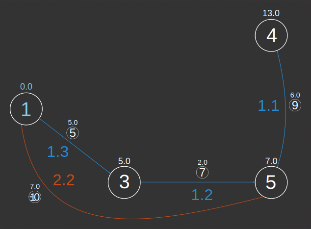
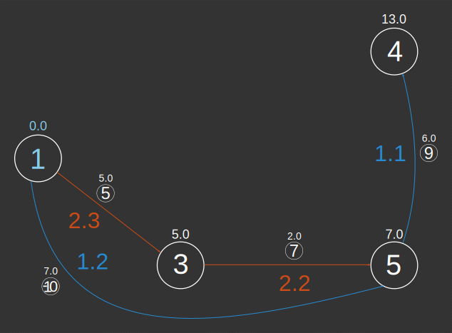

### Signatures


-- Input type:
--     TABLE[EDGE_ID, START_NODE, END_NODE[, w][, eo][, GEOM]]
-- Return type:
--     TABLE[[GEOM, ]EDGE_ID, PATH_ID, PATH_EDGE_ID,
--           SOURCE, DESTINATION, WEIGHT]
ST_ShortestPath('INPUT_EDGES', 'o[ - eo]'[, 'w'], s, d);


### Description

Calculates the shortest path(s) from source vertex `s` to
destination vertex `d`.

  <h5>A note about path numbering.</h5>
  

  <ul>
  <li> Multiple shortest paths are distinguished by
  <code>PATH_ID</code>, while <code>EDGE_ID</code> indicates the ID
  in the input table.  </li>
  <li> Path numbering is <b>not unique</b>. We use a recursive
  algorithm to number shortest path edges. We start at the
  destination vertex and work our way back to the source vertex,
  each time incrementing <code>PATH_EDGE_ID</code> by 1. If at any
  point we reach the source vertex, we increment
  <code>PATH_ID</code> by 1 since we will be numbering a new
  shortest path. As a consequence, <code>PATH_EDGE_ID</code> always
  indicates the number of edges in this shortest path before
  reaching the destination vertex.  </li>
  </ul>
  

##### Input parameters

| Variable      | Meaning                                                                                                                                                                                                                                                                                                                 |
|---------------|-------------------------------------------------------------------------------------------------------------------------------------------------------------------------------------------------------------------------------------------------------------------------------------------------------------------------|
| `INPUT_EDGES` | Table containing integer columns `EDGE_ID`, `START_NODE` and `END_NODE`; and optionally a weight column `w` (if the graph is weighted) and/or an edge orientation column `eo` (required if global orientation is not `undirected`) If it contains a Geometry column, this column will be returned in the output table. |
| `o`           | Global orientation string: `directed`, `reversed` or `undirected`                                                                                                                                                                                                                                                       |
| `eo`          | Edge orientation column name indicating individual edge orientations: `1` (directed), `-1` (reversed) or `0` (undirected); required if global orientation is `directed` or `reversed`                                                                                                                                   |
| `w`           | Edge weights column name                                                                                                                                                                                                                                                                                                |
| `s`           | Source vertex id                                                                                                                                                                                                                                                                                                        |
| `d`           | Destination vertex id                                                                                                                                                                                                                                                                                                   |

### Examples



##### Undirected unweighted


-- We have just enough information to consider an unweighted
-- undirected graph. Notice there are four shortest paths from
-- vertex 1 to vertex 4. You may have a different numbering when you
-- execute this request.
SELECT * FROM ST_ShortestPath('INPUT_EDGES',
        'undirected', 1, 4);
-- |EDGE_ID |PATH_ID |PATH_EDGE_ID | SOURCE | DESTINATION | WEIGHT |
-- |--------|--------|-------------|--------|-------------|--------|
-- |      6 |      1 |           1 |      3 |           4 |    1.0 |
-- |      5 |      1 |           2 |      1 |           3 |    1.0 |
-- |      9 |      2 |           1 |      5 |           4 |    1.0 |
-- |     10 |      2 |           2 |      1 |           5 |    1.0 |
-- |      8 |      3 |           1 |      5 |           4 |    1.0 |
-- |     10 |      3 |           2 |      1 |           5 |    1.0 |
-- |      2 |      4 |           1 |      2 |           4 |    1.0 |
-- |      1 |      4 |           2 |      1 |           2 |    1.0 |


##### Directed Weighted




-- Now we may consider a directed weighted graph. Again, notice this
-- is not really a "tree" in the mathematical sense since there are
-- two shortest paths from vertex 1 to vertex 5. We illustrate the
-- two possible numberings of these paths.
SELECT * FROM ST_ShortestPath('EDGES_EO_W',
        'directed - EDGE_ORIENTATION', 'WEIGHT', 1, 4);
-- Numbering 1:
-- |EDGE_ID |PATH_ID |PATH_EDGE_ID | SOURCE | DESTINATION | WEIGHT |
-- |--------|--------|-------------|--------|-------------|--------|
-- |      9 |      1 |           1 |      5 |           4 |    6.0 |
-- |      7 |      1 |           2 |      3 |           5 |    2.0 |
-- |      5 |      1 |           3 |      1 |           3 |    5.0 |
-- |    -10 |      2 |           2 |      1 |           5 |    7.0 |



-- Numbering 2:
-- |EDGE_ID |PATH_ID |PATH_EDGE_ID | SOURCE | DESTINATION | WEIGHT |
-- |--------|--------|-------------|--------|-------------|--------|
-- |      9 |      1 |           1 |      5 |           4 |    6.0 |
-- |    -10 |      1 |           2 |      1 |           5 |    7.0 |
-- |      7 |      2 |           2 |      3 |           5 |    2.0 |
-- |      5 |      2 |           3 |      1 |           3 |    5.0 |


##### Unreachable vertices


-- If the destination vertex is unreachable from the source vertex,
-- a table with a single line is returned:
SELECT * FROM ST_ShortestPath('INPUT_EDGES',
        'undirected', 1, 6);
-- |EDGE_ID |PATH_ID |PATH_EDGE_ID |SOURCE |DESTINATION | WEIGHT   |
-- |--------|--------|-------------|-------|------------|----------|
-- |     -1 |     -1 |          -1 |     1 |          6 | Infinity |


##### Including Geometries




-- The input table's Geometries are automatically returned in the
-- result.
SELECT * FROM ST_ShortestPath('EDGES_EO_W_GEOM',
        'directed - EDGE_ORIENTATION', 'weight', 1, 4);
-- | GEOM                          | EDGE_ID | PATH_ID | PATH_EDGE_ID | SOURCE | DESTINATION | WEIGHT |
-- |-------------------------------|---------|---------|--------------|--------|-------------|--------|
-- | LINESTRING (2 0, 2.25 1, 2 2) |       9 |       1 |            1 |      5 |           4 |    6.0 |
-- | LINESTRING (1 0, 2 0)         |       7 |       1 |            2 |      3 |           5 |    2.0 |
-- | LINESTRING (0 1, 1 0)         |       5 |       1 |            3 |      1 |           3 |    5.0 |
-- | LINESTRING (2 0, 0 1)         |     -10 |       2 |            2 |      1 |           5 |    7.0 |

-- METHOD 2: Recover Geometries after calculation.
-- Notice the call to the ABS function (edge ids could be negative).
-- We get the same result.
SELECT A.GEOM,
       B.EDGE_ID,
       B.PATH_ID,
       B.PATH_EDGE_ID,
       B.SOURCE,
       B.DESTINATION,
       B.WEIGHT
FROM INPUT A,
     (SELECT * FROM ST_ShortestPath('EDGES_EO_W_GEOM',
        'directed - EDGE_ORIENTATION', 'weight', 1, 4)) B
WHERE A.ID=ABS(B.EDGE_ID);
-- | GEOM                          | EDGE_ID | PATH_ID | PATH_EDGE_ID | SOURCE | DESTINATION | WEIGHT |
-- |-------------------------------|---------|---------|--------------|--------|-------------|--------|
-- | LINESTRING (2 0, 2.25 1, 2 2) |       9 |       1 |            1 |      5 |           4 |    6.0 |
-- | LINESTRING (1 0, 2 0)         |       7 |       1 |            2 |      3 |           5 |    2.0 |
-- | LINESTRING (0 1, 1 0)         |       5 |       1 |            3 |      1 |           3 |    5.0 |
-- | LINESTRING (2 0, 0 1)         |     -10 |       2 |            2 |      1 |           5 |    7.0 |


##### Exercises

1. Check that the sum of the weights of the edges in the path
   returned by `ST_ShortestPath` is equal to the path length
   returned by [`ST_ShortestPathLength`](../ST_ShortestPathLength).
   Watch out for multiple shortest paths!

##### See also

* [`ST_ShortestPathLength`](../ST_ShortestPathLength),
  [`ST_ShortestPathTree`](../ST_ShortestPathTree)
* <a href="https://github.com/orbisgis/h2gis/blob/master/h2gis-network/src/main/java/org/h2gis/network/functions/ST_ShortestPath.java" target="_blank">Source code</a>
