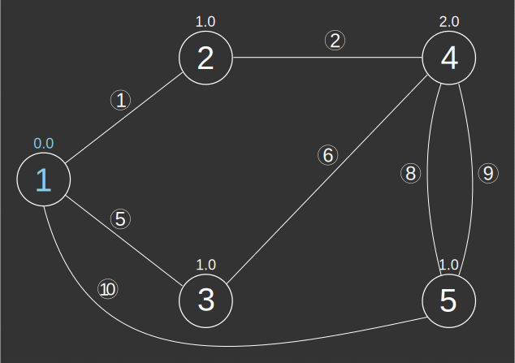

### Signatures


-- Input type:
--     TABLE[EDGE_ID, START_NODE, END_NODE[, w][, eo][, THE_GEOM]]
-- Return type:
--     TABLE[[THE_GEOM, ]EDGE_ID, PATH_ID, PATH_EDGE_ID,
--           SOURCE, DESTINATION, WEIGHT]
-- One-to-One
ST_ShortestPath('INPUT_EDGES', 'o[ - eo]', s, d);
-- One-to-One Weighted
ST_ShortestPath('INPUT_EDGES', 'o[ - eo]', 'w', s, d);


### Description

Calculates the shortest path(s) from source vertex `s` to
destination vertex `d`.
Multiple shortest paths are distinguished by `PATH_ID`.
`EDGE_ID` indicates the ID in `INPUT_EDGES` while `PATH_EDGE_ID` is
a new ID for this path.

##### Input parameters

| Variable      | Meaning                                                                                                                                                                                                                                                                                                                 |
|---------------|-------------------------------------------------------------------------------------------------------------------------------------------------------------------------------------------------------------------------------------------------------------------------------------------------------------------------|
| `INPUT_EDGES` | Table containing integer columns `EDGE_ID`, `START_NODE` and `END_NODE`; and optionally a weight column `w` (if the graph is weighted) and/or an edge orientation column `eo` (required if global orientation is not `undirected`). If it contains a Geometry column, this column will be returned in the output table. |
| `o`           | Global orientation string: `directed`, `reversed` or `undirected`                                                                                                                                                                                                                                                       |
| `eo`          | Edge orientation column name indicating individual edge orientations: `1` (directed), `-1` (reversed) or `0` (undirected); required if global orientation is `directed` or `reversed`                                                                                                                                   |
| `w`           | Edge weights column name                                                                                                                                                                                                                                                                                                |
| `s`           | Source vertex id                                                                                                                                                                                                                                                                                                        |
| `d`           | Destination vertex id                                                                                                                                                                                                                                                                                                   |

### Examples



##### Undirected unweighted


-- We have just enough information to consider an unweighted
-- undirected graph. Notice there are four shortest paths from
-- vertex 1 to vertex 4.
SELECT * FROM ST_ShortestPath('INPUT_EDGES',
        'undirected', 1, 4);
-- |EDGE_ID |PATH_ID |PATH_EDGE_ID | SOURCE | DESTINATION | WEIGHT |
-- |--------|--------|-------------|--------|-------------|--------|
-- |      6 |      1 |           1 |      3 |           4 |    1.0 |
-- |      5 |      1 |           2 |      1 |           3 |    1.0 |
-- |      9 |      2 |           1 |      5 |           4 |    1.0 |
-- |     10 |      2 |           2 |      1 |           5 |    1.0 |
-- |      8 |      3 |           1 |      5 |           4 |    1.0 |
-- |     10 |      3 |           2 |      1 |           5 |    1.0 |
-- |      2 |      4 |           1 |      2 |           4 |    1.0 |
-- |      1 |      4 |           2 |      1 |           2 |    1.0 |






##### See also

* [`ST_ShortestPathLength`](../ST_ShortestPathLength)
* <a href="https://github.com/irstv/H2GIS/blob/master/h2network/src/main/java/org/h2gis/network/graph_creator/ST_ShortestPath.java" target="_blank">Source code</a>
