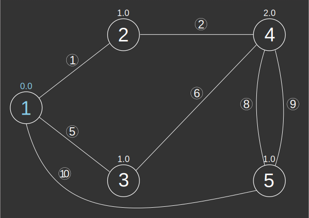
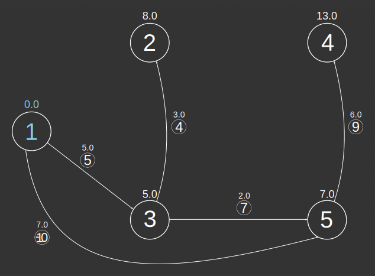
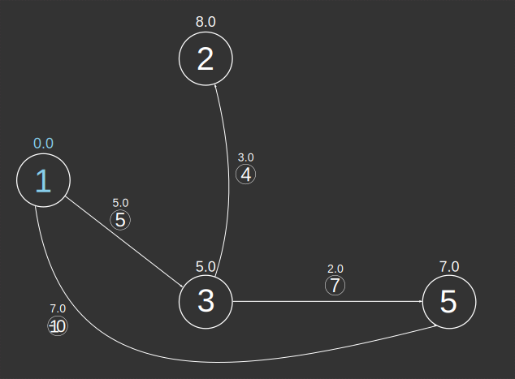

### Signatures


-- Input type:
--     TABLE[EDGE_ID, START_NODE, END_NODE[, w][, eo][, GEOM]]
-- Return type:
--     TABLE[[GEOM, ]EDGE_ID, SOURCE, DESTINATION, WEIGHT]
ST_ShortestPathTree('INPUT_EDGES', 'o[ - eo]'[, 'w'], s)
ST_ShortestPathTree('INPUT_EDGES', 'o[ - eo]'[, 'w'], s, r)


### Description

Calculates the [shortest path tree][wiki] (SPT) from a given vertex
of a graph using Dijkstra's algorithm.

  <h5>The result may not technically be a <a
  href="http://en.wikipedia.org/wiki/Tree_(graph_theory)">tree</a>.</h5>
  
If there are multiple shortest paths, they are all
  returned.

  <h5>Edges are not returned in any particular order.</h5>
  
The SPT is composed of many edges, but their order is not
  important.

  <h5>The SPT is confined to the same (strongly) connected component
  as the source vertex.</h5>
  
That is, it includes only vertices reachable from the source
  vertex. See <a
  href="../ST_ConnectedComponents"><code>ST_ConnectedComponents</code></a>.

##### Input parameters

| Variable      | Meaning                                                                                                                                                                                                                                                                                                                 |
|---------------|-------------------------------------------------------------------------------------------------------------------------------------------------------------------------------------------------------------------------------------------------------------------------------------------------------------------------|
| `INPUT_EDGES` | Table containing integer columns `EDGE_ID`, `START_NODE` and `END_NODE`; and optionally a weight column `w` (if the graph is weighted) and/or an edge orientation column `eo` (required if global orientation is not `undirected`) If it contains a Geometry column, this column will be returned in the output table. |
| `o`           | Global orientation string: `directed`, `reversed` or `undirected`                                                                                                                                                                                                                                                       |
| `eo`          | Edge orientation column name indicating individual edge orientations: `1` (directed), `-1` (reversed) or `0` (undirected); required if global orientation is `directed` or `reversed`                                                                                                                                   |
| `w`           | Edge weights column name                                                                                                                                                                                                                                                                                                |
| `s`           | Source vertex id                                                                                                                                                                                                                                                                                                        |
| `r`           | Radius by which to limit the search (a `DOUBLE`)                                                                                                                                                                                                                                                                        |

### Examples



##### Undirected unweighted


-- We have just enough information to consider an unweighted
-- undirected graph. Notice this is not really a "tree" in the
-- mathematical sense since there are four shortest paths from
-- vertex 1 to vertex 4.
SELECT * FROM ST_ShortestPathTree('INPUT_EDGES',
        'undirected', 1);
-- | EDGE_ID | SOURCE | DESTINATION | WEIGHT |
-- |---------|--------|-------------|--------|
-- |       1 |      1 |           2 |    1.0 |
-- |       9 |      5 |           4 |    1.0 |
-- |       6 |      3 |           4 |    1.0 |
-- |       2 |      2 |           4 |    1.0 |
-- |       8 |      5 |           4 |    1.0 |
-- |       5 |      1 |           3 |    1.0 |
-- |      10 |      1 |           5 |    1.0 |


##### Directed Weighted




-- Now we may consider a directed weighted graph. Again, notice this
-- is not really a "tree" in the mathematical sense since there are
-- two shortest paths from vertex 1 to vertex 5.
SELECT * FROM ST_ShortestPathTree('EDGES_EO_W',
        'directed - EDGE_ORIENTATION', 'WEIGHT', 1);
-- | EDGE_ID | SOURCE | DESTINATION | WEIGHT |
-- |---------|--------|-------------|--------|
-- |       4 |      3 |           2 |    3.0 |
-- |       9 |      5 |           4 |    6.0 |
-- |       5 |      1 |           3 |    5.0 |
-- |     -10 |      1 |           5 |    7.0 |
-- |       7 |      3 |           5 |    2.0 |


##### Including Geometries




-- The input table's Geometries are automatically returned in the
-- result.
SELECT * FROM ST_ShortestPathTree('EDGES_EO_W_GEOM',
        'directed - EDGE_ORIENTATION', 'weight', 1);
-- | GEOM                          | EDGE_ID | SOURCE | DESTINATION | WEIGHT |
-- |-------------------------------|---------|--------|-------------|--------|
-- | LINESTRING (1 0, 1.25 1, 1 2) |       4 |      3 |           2 |    3.0 |
-- | LINESTRING (2 0, 2.25 1, 2 2) |       9 |      5 |           4 |    6.0 |
-- | LINESTRING (0 1, 1 0)         |       5 |      1 |           3 |    5.0 |
-- | LINESTRING (2 0, 0 1)         |     -10 |      1 |           5 |    7.0 |
-- | LINESTRING (1 0, 2 0)         |       7 |      3 |           5 |    2.0 |

-- METHOD 2: Recover Geometries after calculation.
-- Notice the call to the ABS function (edge ids could be negative).
-- We get the same result.
SELECT A.GEOM,
       B.EDGE_ID,
       B.SOURCE,
       B.DESTINATION,
       B.WEIGHT
FROM INPUT A,
     (SELECT * FROM ST_ShortestPathTree('EDGES_EO_W',
                 'directed - EDGE_ORIENTATION', 'weight', 1)) B
WHERE A.ID=ABS(B.EDGE_ID);
-- | GEOM                          | EDGE_ID | SOURCE | DESTINATION | WEIGHT |
-- |-------------------------------|---------|--------|-------------|--------|
-- | LINESTRING (1 0, 1.25 1, 1 2) |       4 |      3 |           2 |    3.0 |
-- | LINESTRING (2 0, 2.25 1, 2 2) |       9 |      5 |           4 |    6.0 |
-- | LINESTRING (0 1, 1 0)         |       5 |      1 |           3 |    5.0 |
-- | LINESTRING (2 0, 0 1)         |     -10 |      1 |           5 |    7.0 |
-- | LINESTRING (1 0, 2 0)         |       7 |      3 |           5 |    2.0 |


##### Limiting by search radius


-- Notice that now edge 9 is no longer a part of the SPT since
-- d(1, 4)=13.0 > 8.5.
SELECT * FROM ST_ShortestPathTree('EDGES_EO_W',
        'directed - EDGE_ORIENTATION', 'WEIGHT', 1, 8.5);
-- | EDGE_ID | SOURCE | DESTINATION | WEIGHT |
-- |---------|--------|-------------|--------|
-- |       4 |      3 |           2 |    3.0 |
-- |       5 |      1 |           3 |    5.0 |
-- |       7 |      3 |           5 |    2.0 |
-- |     -10 |      1 |           5 |    7.0 |


##### Exercises

1. Try doing similar calculations for
    * an unweighted directed graph
    * a weighted undirected graph
    * a weighted reversed graph
2. Find a source vertex and a graph configuration such that the SPT
   returned by `ST_ShortestPathTree` is in fact a tree.

##### See also

* [`ST_ShortestPath`](../ST_ShortestPath),
  [`ST_ShortestPathLength`](../ST_ShortestPathLength),
  [`ST_ConnectedComponents`](../ST_ConnectedComponents)
* <a href="https://github.com/orbisgis/h2gis/blob/master/h2gis-network/src/main/java/org/h2gis/network/functions/ST_ShortestPathTree.java" target="_blank">Source code</a>

[wiki]: http://en.wikipedia.org/wiki/Shortest-path_tree
