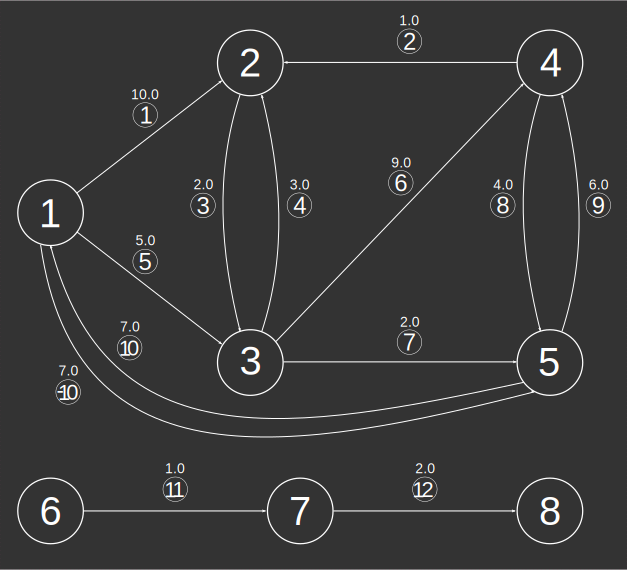

### Signatures


-- Return type:
--     TABLE[THE_GEOM, EDGE_ID, TREE_ID,
--           SOURCE, DESTINATION, WEIGHT]
ST_ShortestPathTree('INPUT_EDGES', 'o[ - eo]'[, 'w'], s)
ST_ShortestPathTree('INPUT_EDGES', 'o[ - eo]'[, 'w'], s, r)


### Description

Calculates the shortest path tree from a given vertex of a
graph using Dijkstra's algorithm.

##### Input parameters

| Variable      | Meaning                                                                                                                                                                                                                                                  |
|---------------|----------------------------------------------------------------------------------------------------------------------------------------------------------------------------------------------------------------------------------------------------------|
| `INPUT_EDGES` | Edges table produced by `ST_Graph` from table `input`                                                                                                                                                                                                    |
| `INPUT_EDGES` | Table containing integer columns `EDGE_ID`, `START_NODE` and `END_NODE` and a Geometry column; and optionally a weight column `w` (if the graph is weighted) and/or an edge orientation column `eo` (required if global orientation is not `undirected`) |
| `o`           | Global orientation string: `directed`, `reversed` or `undirected`                                                                                                                                                                                        |
| `eo`          | Edge orientation column name indicating individual edge orientations: `1` (directed), `-1` (reversed) or `0` (undirected); required if global orientation is `directed` or `reversed`                                                                    |
| `w`           | Edge weights column name                                                                                                                                                                                                                                 |
| `s`           | Source vertex id                                                                                                                                                                                                                                         |
| `r`           | Radius by which to limit the search (a `DOUBLE`)                                                                                                                                                                                                         |

### Examples


-- Prepare example data. We give an illustration of the graph this
-- represents below.
DROP TABLE IF EXISTS INPUT;
CREATE TABLE INPUT(THE_GEOM LINESTRING,
                   ID INT AUTO_INCREMENT PRIMARY KEY,
                   WEIGHT DOUBLE,
                   EDGE_ORIENTATION INT);
INSERT INTO INPUT VALUES
    ('LINESTRING (0 1, 1 2)', DEFAULT, 10.0, 1),
    ('LINESTRING (1 2, 2 2)', DEFAULT, 1.0, -1),
    ('LINESTRING (1 2, 0.75 1, 1 0)', DEFAULT, 2.0,  1),
    ('LINESTRING (1 0, 1.25 1, 1 2)', DEFAULT, 3.0,  1),
    ('LINESTRING (0 1, 1 0)', DEFAULT, 5.0,  1),
    ('LINESTRING (1 0, 2 2)', DEFAULT, 9.0,  1),
    ('LINESTRING (1 0, 2 0)', DEFAULT, 2.0,  1),
    ('LINESTRING (2 2, 1.75 1, 2 0)', DEFAULT, 4.0,  1),
    ('LINESTRING (2 0, 2.25 1, 2 2)', DEFAULT, 6.0,  1),
    ('LINESTRING (2 0, 0 1)', DEFAULT, 7.0,  0),
    ('LINESTRING (3 1, 4 2)', DEFAULT, 1.0, 1),
    ('LINESTRING (4 2, 5 2)', DEFAULT, 2.0, 1);
DROP TABLE IF EXISTS INPUT_NODES;
DROP TABLE IF EXISTS INPUT_EDGES;
CALL ST_Graph('INPUT');
SELECT * FROM INPUT_EDGES;
-- | EDGE_ID | START_NODE | END_NODE |
-- |---------|------------|----------|
-- |       1 |          1 |        2 |
-- |       2 |          2 |        4 |
-- |       3 |          2 |        3 |
-- |       4 |          3 |        2 |
-- |       5 |          1 |        3 |
-- |       6 |          3 |        4 |
-- |       7 |          3 |        5 |
-- |       8 |          4 |        5 |
-- |       9 |          5 |        4 |
-- |      10 |          5 |        1 |
-- |      11 |          6 |        7 |
-- |      12 |          7 |        8 |

-- ST_Graph gives us the right connections, but we have lost some
-- information along the way, such as edge orientations and weights.
-- We recover this information in the next SQL request.



-- Recover Geometries, weight and edge orientations
DROP TABLE IF EXISTS EDGES;
CREATE TABLE EDGES(THE_GEOM LINESTRING,
                   EDGE_ID INT PRIMARY KEY,
                   START_NODE INT,
                   END_NODE INT,
                   WEIGHT DOUBLE,
                   EDGE_ORIENTATION INT) AS
    SELECT A.THE_GEOM,
           B.EDGE_ID,
           B.START_NODE,
           B.END_NODE,
           A.WEIGHT,
           A.EDGE_ORIENTATION
    FROM INPUT A, INPUT_EDGES B
    WHERE A.ID=B.EDGE_ID;
SELECT * FROM EDGES;
-- | THE_GEOM                      | EDGE_ID | START_NODE | END_NODE | WEIGHT | EDGE_ORIENTATION |
-- |-------------------------------|---------|------------|----------|--------|------------------|
-- | LINESTRING (0 1, 1 2)         |       1 |          1 |        2 |   10.0 |                1 |
-- | LINESTRING (1 2, 2 2)         |       2 |          2 |        4 |    1.0 |               -1 |
-- | LINESTRING (1 2, 0.75 1, 1 0) |       3 |          2 |        3 |    2.0 |                1 |
-- | LINESTRING (1 0, 1.25 1, 1 2) |       4 |          3 |        2 |    3.0 |                1 |
-- | LINESTRING (0 1, 1 0)         |       5 |          1 |        3 |    5.0 |                1 |
-- | LINESTRING (1 0, 2 2)         |       6 |          3 |        4 |    9.0 |                1 |
-- | LINESTRING (1 0, 2 0)         |       7 |          3 |        5 |    2.0 |                1 |
-- | LINESTRING (2 2, 1.75 1, 2 0) |       8 |          4 |        5 |    4.0 |                1 |
-- | LINESTRING (2 0, 2.25 1, 2 2) |       9 |          5 |        4 |    6.0 |                1 |
-- | LINESTRING (2 0, 0 1)         |      10 |          5 |        1 |    7.0 |                0 |
-- | LINESTRING (3 1, 4 2)         |      11 |          6 |        7 |    1.0 |                1 |
-- | LINESTRING (4 2, 5 2)         |      12 |          7 |        8 |    2.0 |                1 |


##### Unlimited search


-- Notice this is not really a "tree" in the mathematical sense
-- since there are two shortest paths from vertex 1 to vertex 5.
SELECT * FROM
    ST_ShortestPathTree('EDGES',
        'directed - EDGE_ORIENTATION',
        'WEIGHT', 1);
-- | THE_GEOM                     | EDGE_ID | TREE_ID | SOURCE | DESTINATION | WEIGHT |
-- |------------------------------|---------|---------|--------|-------------|--------|
-- | LINESTRING(1 0, 1.25 1, 1 2) |       4 |       1 |      3 |           2 |    3.0 |
-- | LINESTRING(2 0, 2.25 1, 2 2) |       9 |       2 |      5 |           4 |    6.0 |
-- | LINESTRING(0 1, 1 0)         |       5 |       3 |      1 |           3 |    5.0 |
-- | LINESTRING(1 0, 2 0)         |       7 |       4 |      3 |           5 |    2.0 |
-- | LINESTRING(2 0, 0 1)         |     -10 |       5 |      1 |           5 |    7.0 |


##### See also

* [`ST_ShortestPath`](../ST_ShortestPath),
  [`ST_ShortestPathLength`](../ST_ShortestPathLength)
* <a href="https://github.com/irstv/H2GIS/blob/master/h2network/src/main/java/org/h2gis/network/graph_creator/ST_ShortestPathTree.java" target="_blank">Source code</a>
