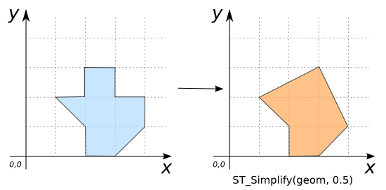

### Signature


GEOMETRY ST_Simplify(GEOMETRY geom, DOUBLE distance);


### Description

Simplifies `geom` using the [Douglas-Peuker][wiki] algorithm with a
distance tolerance of `distance`. Ensures that resulting polygonal
geometries are valid.

    <h5>The Douglas-Peucker algorithm does not preserve topology.</h5>
    
To preserve the topology, use <a
    href="../ST_SimplifyPreserveTopology"><code>ST_SimplifyPreserveTopology</code></a>.
    But note that <code>ST_Simplify</code> is significantly faster.
    

### Examples


SELECT ST_Simplify('POLYGON((2 1, 1 2, 2 2, 2 3, 3 3, 3 2,
                             4 2, 4 1, 3 0, 2 0, 2 1))',
                    0.5)
-- Answer: POLYGON((2 1, 1 2, 3 3, 4 1, 3 0, 2 0, 2 1))



SELECT ST_Simplify('POLYGON((2 1, 1 2, 2 2, 2 3, 3 3, 3 2,
                             4 2, 4 1, 3 0, 2 0, 2 1))',
                    1)
-- Answer:POLYGON((2 1, 1 2, 3 3, 4 1, 2 1))



-- If the distance tolerance is too large, the Geometry may be
-- oversimplified:
SELECT ST_Simplify('POLYGON((2 1, 1 2, 2 2, 2 3, 3 3, 3 2,
                             4 2, 4 1, 3 0, 2 0, 2 1))',
                    2)
-- Answer: POLYGON EMPTY

-- POINTs and MULTIPOINTs cannot be further simplified:
SELECT ST_Simplify('MULTIPOINT((190 300), (10 11))', 4);
-- Answer: MULTIPOINT((190 300), (10 11))

-- Simplify a LINESTRING:
SELECT ST_Simplify('LINESTRING(250 250, 280 290, 300 230, 340 300,
                               360 260, 440 310, 470 360, 604 286)',
                   40);
-- Answer: LINESTRING(250 250, 280 290, 300 230, 470 360, 604 286)


##### Comparison with [`ST_SimplifyPreserveTopology`](../ST_SimplifyPreserveTopology)



##### See also

* [`ST_SimplifyPreserveTopology`](../ST_SimplifyPreserveTopology)
* <a href="https://github.com/irstv/H2GIS/blob/master/h2spatial-ext/src/main/java/org/h2gis/h2spatialext/function/spatial/processing/ST_Simplify.java" target="_blank">Source code</a>
* JTS [DouglasPeuckerSimplifier#simplify][jts]
* Added: <a href="https://github.com/irstv/H2GIS/pull/80" target="_blank">#80</a>

[jts]: http://tsusiatsoftware.net/jts/javadoc/com/vividsolutions/jts/simplify/DouglasPeuckerSimplifier.html#simplify(com.vividsolutions.jts.geom.Geometry, double)
[wiki]: http://en.wikipedia.org/wiki/Ramer%E2%80%93Douglas%E2%80%93Peucker_algorithm
