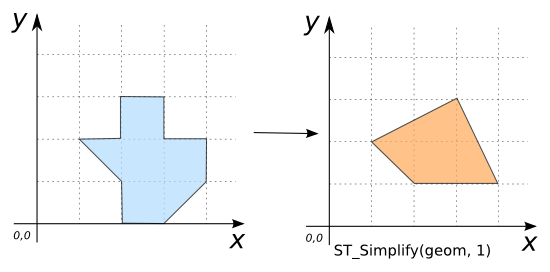

### Signature


GEOMETRY ST_Simplify(GEOMETRY geom, double distance);


### Description
Returns a simplified version of the given `GEOMETRY` using the Douglas-Peuker algorithm.
The variable `distance` is a distance tolerance for the simplification.

    <h5>The standard Douglas-Peucker algorithm does not preserve topology.
    If you want to preserve the topology you can use [`ST_SimplifyPreserveTopology`](../ST_SimplifyPreserveTopology)function.</h5>

### Examples


SELECT ST_Simplify('POLYGON((2 1, 1 2, 2 2, 2 3, 3 3, 3 2, 
                             4 2, 4 1, 3 0, 2 0, 2 1))', 
                    0.5)
-- Answer: POLYGON((2 1, 1 2, 3 3, 4 1, 3 0, 2 0, 2 1))



SELECT ST_Simplify('POLYGON((2 1, 1 2, 2 2, 2 3, 3 3, 3 2, 
                             4 2, 4 1, 3 0, 2 0, 2 1))', 
                    1)
-- Answer:POLYGON((2 1, 1 2, 3 3, 4 1, 2 1))



SELECT ST_Simplify('POLYGON((2 1, 1 2, 2 2, 2 3, 3 3, 3 2, 
                             4 2, 4 1, 3 0, 2 0, 2 1))', 
                    2)
-- Answer: POLYGON EMPTY

SELECT ST_Simplify('MULTIPOINT((190 300), (10 11))', 4);
-- Answer: MULTIPOINT((190 300), (10 11))

SELECT ST_Simplify('LINESTRING(250 250, 280 290, 300 230, 
                                340 300, 360 260, 440 310, 
                                470 360, 604 286)', 
                    40);
-- Answer: LINESTRING(250 250, 280 290, 300 230, 470 360, 
--                    604 286)


##### Comparison with [`ST_SimplifyPreserveTopology`](../ST_SimplifyPreserveTopology)



##### See also

* [`ST_SimplifyPreserveTopology`](../ST_SimplifyPreserveTopology)
* <a href="https://github.com/irstv/H2GIS/blob/master/h2spatial-ext/src/main/java/org/h2gis/h2spatialext/function/spatial/processing/ST_Simplify.java" target="_blank">Source code</a>
* Added: <a href="https://github.com/irstv/H2GIS/pull/80" target="_blank">#80</a>

