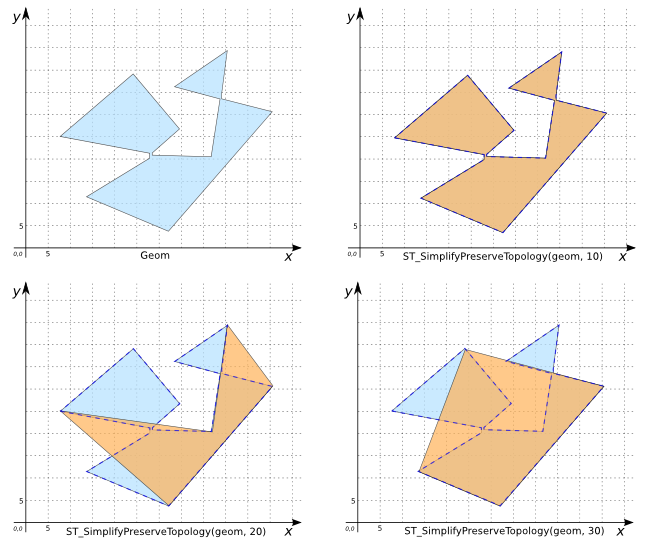

### Signature


GEOMETRY ST_SimplyPreserveTopology(GEOMETRY geom, 
                                   double distance);


### Description
Returns a simplified Geometry and ensures that the result having the same dimension and number of components as the input, and with the components having the same topological relationship.

    <h5>If the input Geometry is invalid then the output Geometry can
    	be invalid.</h5>

### Examples

|           Geom Polygon                       |    |
|----------------------------------------------|----|
| POLYGON((8 25, 28 22, 28 20, 15 11, 33 3, 56 30, 46 33, 46 34, 47 44, 35 36, 45 33, 43 19, 29 21, 29 22, 35 26, 24 39, 8 25)) |    |


SELECT st_simplifypreservetopology(geom, 10);
-- Answer: POLYGON((8 25, 28 22, 28 20, 15 11, 33 3, 
--                  56 30, 46 33, 46 34, 47 44, 35 36, 
--                  45 33, 43 19, 29 21, 29 22, 35 26, 
--                  24 39, 8 25))

SELECT st_simplifypreservetopology(geom, 20);
-- Answer:POLYGON((8 25, 33 3, 56 30, 47 44, 43 19, 8 25))

SELECT st_simplifypreservetopology(geom, 30);
-- Answer: POLYGON((8 25, 33 3, 56 30, 47 44, 8 25))



SELECT ST_SimplifyPreserveTopology('MULTIPOINT((190 300), 
                                               (10 11))', 
                                    4);
-- Answer: MULTIPOINT((190 300), (10 11))

SELECT ST_SimplifyPreserveTopology('LINESTRING(250 250, 280 290, 
                                               300 230, 340 300, 
                                               360 260, 440 310, 
                                               470 360, 604 286)', 
                                    40);
-- Answer: LINESTRING(250 250, 280 290, 300 230, 470 360, 604 286)


##### Comparison with [`ST_Simplify`](../ST_Simplify)



##### See also

* [`ST_Simplify`](../ST_Simplify)
* <a href="https://github.com/irstv/H2GIS/blob/master/h2spatial-ext/src/main/java/org/h2gis/h2spatialext/function/spatial/processing/ST_SimplifyPreserveTopology.java" target="_blank">Source code</a>
* Added: <a href="https://github.com/irstv/H2GIS/pull/80" target="_blank">#80</a>

