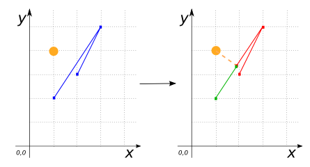

### Signatures


GEOMETRY ST_Split(GEOMETRY geomA, GEOMETRY geomB);
(MULTI)LINESTRING ST_Split((MULTI)LINESTRING geomA, POINT geomB,
double tolerance);


### Description
Returns a GEOMETRY resulting from split between `geomA` and `geomB`.
Split `GeomA` according `GeomB`.
Supported operations are:

* a LINESTRING by a POINT
It's possible to using a snapping `tolerance`. If a `tolerance` is not define, the `tolerance` 10E-6 is used to snap the cutter point.
* a LINESTRING by a LINESTRING
* a POLYGON by a LINESTRING.

### Examples

#####LINESTRING by a POINT

SELECT ST_Split('LINESTRING(4 3, 4 5, 2 3)',
                'POINT(3 4)');
-- Answer: MULTILINESTRING((4 3, 4 5, 3 4), (3 4, 2 3))

SELECT ST_Split('LINESTRING(3 3, 4 5, 2 2)',
                'POINT(2 4)');
-- Answer: MULTILINESTRING EMPTY

SELECT ST_Split('LINESTRING(3 3, 4 5, 2 2)',
                'POINT(2 4)',
                4);
-- Answer: MULTILINESTRING((3 3, 4 5, 2.92307 3.3846),
--                         (2.92307 3.38461, 2 2))


#####LINESTRING by a  LINESTRING
|geomA LINESTRING |geomB LINESTRING|
|--|--|
| LINESTRING(0 3, 1 3, 3 3, 6 3) | LINESTRING(5 6, 5 0) |


SELECT ST_Split(geomA, geomB);
-- Answer: MULTILINESTRING((0 3, 1 3, 3 3, 5 3),
--                         (5 3, 6 3))

SELECT ST_Split(geomB, geomA);
-- Answer: MULTILINESTRING((5 6, 5 3),
--                         (5 3, 5 0))


#####POLYGON by a  LINESTRING

SELECT ST_Split('POLYGON((0 0, 5 0, 5 5, 0 5, 0 0))',
                'LINESTRING(2 0, 2 5)');
-- Answer: MULTIPOLYGON(((2 0, 0 0, 0 5, 2 5, 2 0)),
                        ((5 5, 5 0, 2 0, 2 5, 5 5)))



SELECT ST_Split('POLYGON((0 0, 10 0, 10 10, 0 10, 0 0))',
                'LINESTRING(5 1, 5 12)');
-- Answer: NULL

SELECT ST_Split('POLYGON((0 0, 10 0, 10 10, 0 10, 0 0),
                         (2 2, 7 2, 7 7, 2 7, 2 2))',
                'LINESTRING(5 0, 5 10)');
-- Answer: MULTIPOLYGON(((5 0, 0 0, 0 10, 5 10, 5 7, 2 7,
                           2 2, 5 2, 5 0)),
                         ((5 10, 10 10, 10 0, 5 0, 5 2, 7 2,
                           7 7, 5 7, 5 10)))


##### See also

* <a href="https://github.com/irstv/H2GIS/blob/master/h2spatial-ext/src/main/java/org/h2gis/h2spatialext/function/spatial/processing/ST_Split.java" target="_blank">Source code</a>
* Added: <a href="https://github.com/irstv/H2GIS/pull/80" target="_blank">#80</a>
