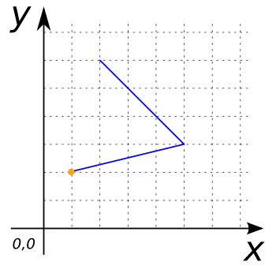

### Signature


POINT ST_StartPoint(GEOMETRY geom);


### Description

Returns the first `POINT` of a `LINESTRING` as a `POINT`.
If the input parameter is not a `LINESTRING` this function returns `null`.



### Example


SELECT ST_StartPoint('LINESTRING(1 2, 5 3, 2 6)');
-- Answer: POINT(1 2)


##### See also

* [`ST_EndPoint`](../ST_EndPoint)
* <a href="https://github.com/irstv/H2GIS/blob/master/h2spatial/src/main/java/org/h2gis/h2spatial/internal/function/spatial/properties/ST_StartPoint.java" target="_blank">Source code</a>
