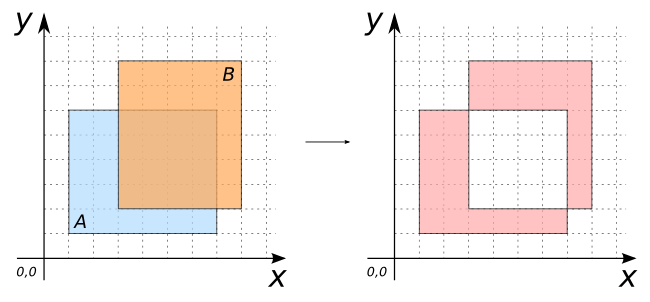

### Signatures


GEOMETRY ST_SymDifference(geomA, geomB)


### Description

Computes the symmetric difference between `geomA` and `geomB`.



### Examples

| geomA Polygon | geomB Polygon |
| ----|---- |
| POLYGON((1 1, 7 1, 7 6, 1 6, 1 1)) | POLYGON((3 2, 8 2, 8 8, 3 8, 3 2)) |


SELECT ST_Difference(geomA, geomB);
-- Answer: MULTIPOLYGON(((1 1, 7 1, 7 2, 3 2, 3 6, 1 6, 1 1)), 
--                     ((7 2, 8 2, 8 8, 3 8, 3 6, 7 6, 7 2)))


##### See also

* [`ST_Difference`](../ST_Difference)
* <a href="https://github.com/irstv/H2GIS/blob/master/h2spatial/src/main/java/org/h2gis/h2spatial/internal/function/spatial/operators/ST_SymDifference.java" target="_blank">Source code</a>
